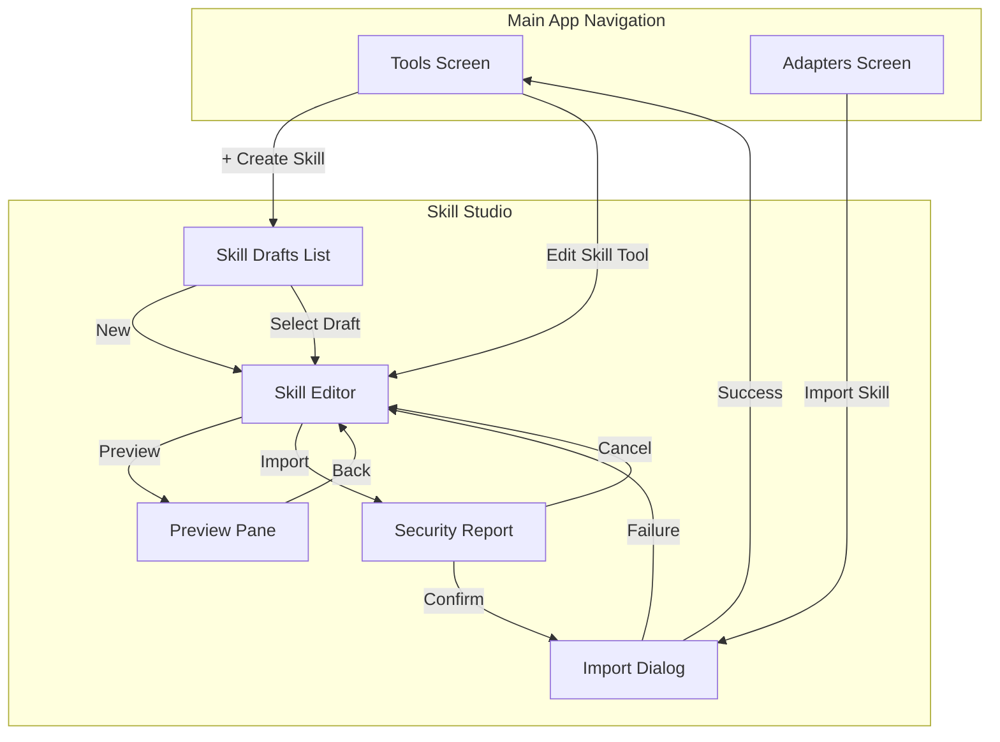
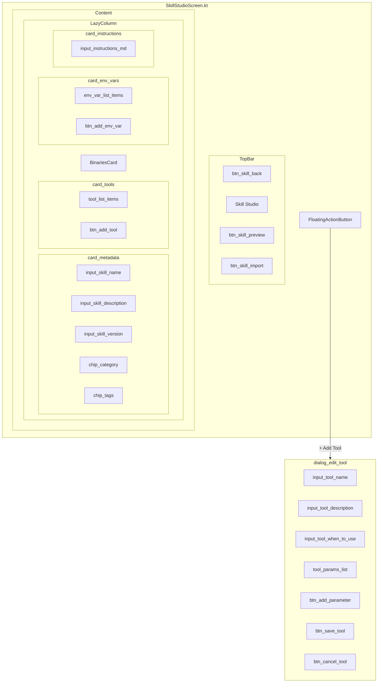
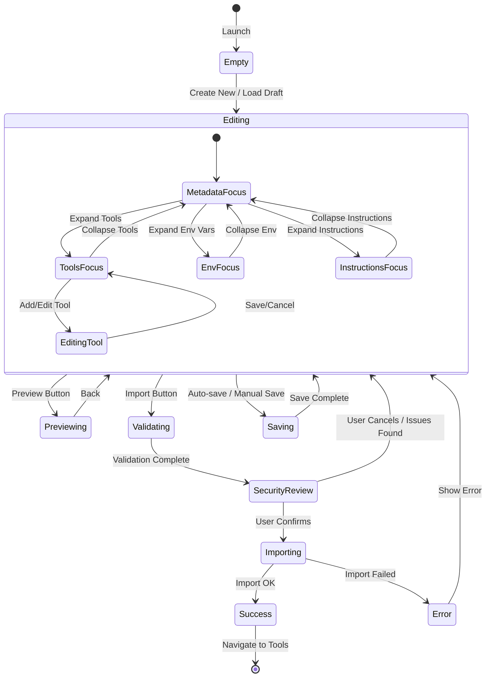
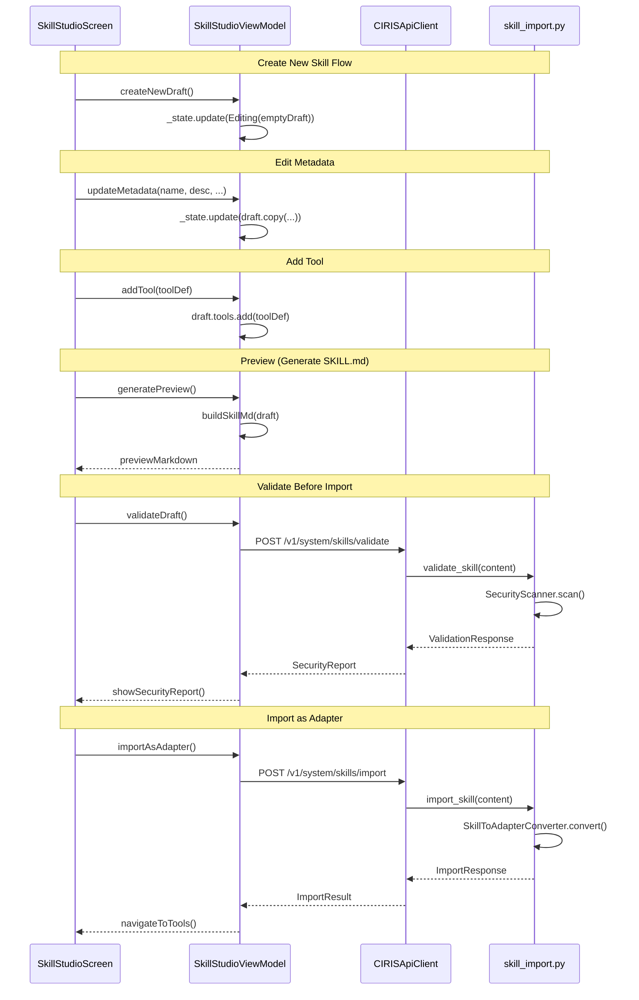
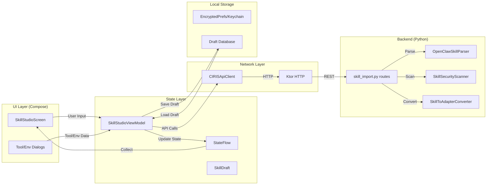
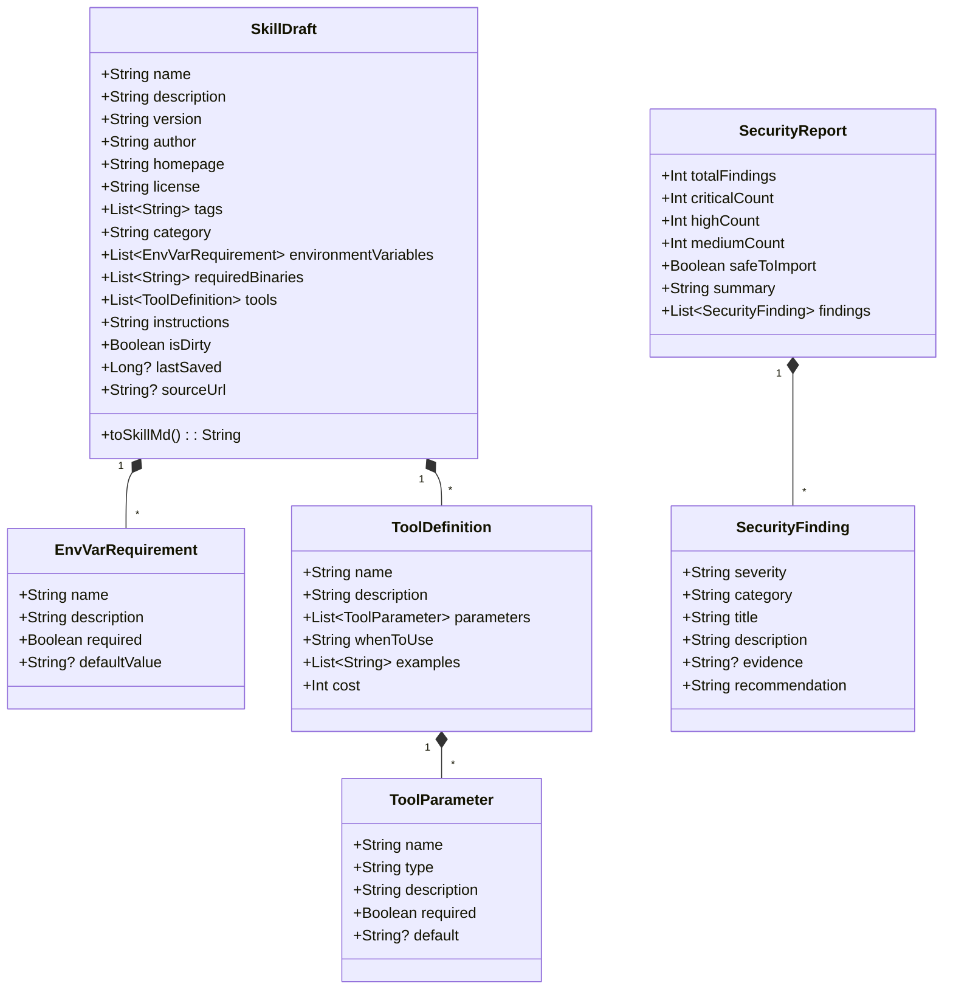

# Skill Studio Implementation Diagrams

## 1. Navigation & Screen Flow



## 2. UI Component Hierarchy



## 3. State Machine



## 4. API Interaction Sequence



## 5. Data Flow



## 6. SkillDraft Data Model



## 7. Screen Layouts

### 7.1 Main Editor Screen

```
┌─────────────────────────────────────────────────────────────┐
│  ◀ [btn_skill_back]   Skill Studio    👁 [btn_skill_preview] │
│                                        📥 [btn_skill_import] │
├─────────────────────────────────────────────────────────────┤
│                                                             │
│  ┌─────────────────────────────────────────────────────┐   │
│  │  📦 Metadata [card_metadata]                   ▼    │   │
│  │  ─────────────────────────────────────────────────  │   │
│  │  Name: [input_skill_name___________________]        │   │
│  │  Desc: [input_skill_description____________]        │   │
│  │  Ver:  [input_skill_version] Cat: [chip_category]   │   │
│  │  Tags: [chip_tags_container_______________]         │   │
│  └─────────────────────────────────────────────────────┘   │
│                                                             │
│  ┌─────────────────────────────────────────────────────┐   │
│  │  🔧 Tools (2) [card_tools]                     ▶    │   │
│  └─────────────────────────────────────────────────────┘   │
│                                                             │
│  ┌─────────────────────────────────────────────────────┐   │
│  │  🔑 Environment Variables (1) [card_env_vars]  ▶    │   │
│  └─────────────────────────────────────────────────────┘   │
│                                                             │
│  ┌─────────────────────────────────────────────────────┐   │
│  │  📝 Instructions [card_instructions]           ▼    │   │
│  │  ─────────────────────────────────────────────────  │   │
│  │  [input_instructions_md                           ] │   │
│  │  [                                                ] │   │
│  │  [# Weather Skill                                 ] │   │
│  │  [                                                ] │   │
│  │  [This skill provides weather information...      ] │   │
│  └─────────────────────────────────────────────────────┘   │
│                                                             │
│                                         [fab_add_tool] (+)  │
└─────────────────────────────────────────────────────────────┘
```

### 7.2 Tools Card Expanded

```
┌─────────────────────────────────────────────────────────────┐
│  🔧 Tools (2) [card_tools]                             ▼   │
│  ─────────────────────────────────────────────────────────  │
│                                                             │
│  ┌───────────────────────────────────────────────────┐     │
│  │ [item_tool_0]                                     │     │
│  │ 🔧 get_weather                       [btn_edit] ✏️│     │
│  │    Get current weather for a location [btn_del] 🗑️│     │
│  │    Params: location (string), units (string)      │     │
│  └───────────────────────────────────────────────────┘     │
│                                                             │
│  ┌───────────────────────────────────────────────────┐     │
│  │ [item_tool_1]                                     │     │
│  │ 🔧 get_forecast                      [btn_edit] ✏️│     │
│  │    Get 5-day weather forecast        [btn_del] 🗑️│     │
│  │    Params: location (string), days (int)          │     │
│  └───────────────────────────────────────────────────┘     │
│                                                             │
│  [btn_add_tool] + Add Tool                                  │
└─────────────────────────────────────────────────────────────┘
```

### 7.3 Tool Edit Dialog

```
┌─────────────────────────────────────────────────────────────┐
│  Edit Tool [dialog_edit_tool]                          ✕   │
├─────────────────────────────────────────────────────────────┤
│                                                             │
│  Name [input_tool_name]:                                    │
│  [get_weather_____________________________________]         │
│                                                             │
│  Description [input_tool_description]:                      │
│  [Get current weather conditions for a location___]         │
│                                                             │
│  Cost [input_tool_cost]:                                    │
│  [0] credits                                                │
│                                                             │
│  When to Use [input_tool_when_to_use]:                     │
│  ┌───────────────────────────────────────────────────────┐ │
│  │ Use when the user asks about current weather,         │ │
│  │ temperature, or conditions for a specific location.   │ │
│  └───────────────────────────────────────────────────────┘ │
│                                                             │
│  Parameters [list_tool_params]:                            │
│  ┌───────────────────────────────────────────────────────┐ │
│  │ location (string) *required          [btn_edit] [🗑️]  │ │
│  │   City name or coordinates                            │ │
│  ├───────────────────────────────────────────────────────┤ │
│  │ units (string) default: "metric"     [btn_edit] [🗑️]  │ │
│  │   Temperature units (metric/imperial)                 │ │
│  └───────────────────────────────────────────────────────┘ │
│  [btn_add_parameter] + Add Parameter                        │
│                                                             │
│                       [btn_cancel_tool] Cancel              │
│                       [btn_save_tool] Save Tool             │
└─────────────────────────────────────────────────────────────┘
```

### 7.4 Preview Screen

```
┌─────────────────────────────────────────────────────────────┐
│  ◀ [btn_preview_back]  Preview         [btn_copy_md] Copy  │
├─────────────────────────────────────────────────────────────┤
│  [tab_skill_md] SKILL.md │ [tab_security] Security │       │
│  ═══════════════════════   ────────────────────────        │
│                                                             │
│  ┌───────────────────────────────────────────────────────┐ │
│  │ ---                                                   │ │
│  │ name: weather-skill                                   │ │
│  │ description: Get weather forecasts for any location   │ │
│  │ version: 1.0.0                                        │ │
│  │ category: general                                     │ │
│  │ tags: [weather, api]                                  │ │
│  │ metadata:                                             │ │
│  │   openclaw:                                           │ │
│  │     requires:                                         │ │
│  │       env: [WEATHER_API_KEY]                          │ │
│  │     skill_key: weather                                │ │
│  │ ---                                                   │ │
│  │                                                       │ │
│  │ # Weather Skill                                       │ │
│  │                                                       │ │
│  │ This skill provides weather information using         │ │
│  │ the OpenWeatherMap API.                              │ │
│  │                                                       │ │
│  │ ## Tools                                              │ │
│  │                                                       │ │
│  │ ### get_weather                                       │ │
│  │ Get current weather for a location.                   │ │
│  │ - location (string, required): City or coords         │ │
│  │ - units (string, default: metric)                     │ │
│  └───────────────────────────────────────────────────────┘ │
│                                                             │
│                              [btn_import_now] Import Now    │
└─────────────────────────────────────────────────────────────┘
```

### 7.5 Security Report Screen

```
┌─────────────────────────────────────────────────────────────┐
│  ◀ [btn_security_back]  Security Report                    │
├─────────────────────────────────────────────────────────────┤
│                                                             │
│  ┌───────────────────────────────────────────────────────┐ │
│  │  ✅ SAFE TO IMPORT                                    │ │
│  │  ─────────────────────────────────────────────────    │ │
│  │  No critical or high severity issues found.           │ │
│  │                                                       │ │
│  │  📊 Summary:                                          │ │
│  │  • Critical: 0  • High: 0  • Medium: 1  • Low: 2     │ │
│  └───────────────────────────────────────────────────────┘ │
│                                                             │
│  ┌───────────────────────────────────────────────────────┐ │
│  │  ⚠️ MEDIUM: Undeclared network access                 │ │
│  │  ─────────────────────────────────────────────────    │ │
│  │  This skill uses 'curl' but doesn't list it          │ │
│  │  in requirements.                                     │ │
│  │                                                       │ │
│  │  Evidence: curl https://api.openweathermap.org        │ │
│  │                                                       │ │
│  │  Recommendation: Add 'curl' to required binaries     │ │
│  └───────────────────────────────────────────────────────┘ │
│                                                             │
│  ┌───────────────────────────────────────────────────────┐ │
│  │  ℹ️ LOW: Uses secret not listed in requirements       │ │
│  │  ─────────────────────────────────────────────────    │ │
│  │  Instructions mention 'WEATHER_API_KEY' but it's     │ │
│  │  already declared. (False positive)                   │ │
│  └───────────────────────────────────────────────────────┘ │
│                                                             │
│         [btn_cancel_import] Cancel                          │
│         [btn_confirm_import] Import Anyway                  │
└─────────────────────────────────────────────────────────────┘
```

## 8. Test Tags Reference

| Element | Test Tag | Type |
|---------|----------|------|
| Back button | `btn_skill_back` | IconButton |
| Preview button | `btn_skill_preview` | IconButton |
| Import button | `btn_skill_import` | Button |
| Metadata card | `card_metadata` | Card |
| Skill name input | `input_skill_name` | TextField |
| Skill description | `input_skill_description` | TextField |
| Skill version | `input_skill_version` | TextField |
| Category chip | `chip_category` | FilterChip |
| Tags container | `chip_tags_container` | FlowRow |
| Tools card | `card_tools` | Card |
| Tool item | `item_tool_{index}` | ListItem |
| Add tool button | `btn_add_tool` | Button |
| Edit tool button | `btn_edit_tool_{index}` | IconButton |
| Delete tool button | `btn_delete_tool_{index}` | IconButton |
| Env vars card | `card_env_vars` | Card |
| Add env var button | `btn_add_env_var` | Button |
| Instructions card | `card_instructions` | Card |
| Instructions input | `input_instructions_md` | TextField |
| FAB add tool | `fab_add_tool` | FAB |
| Tool dialog | `dialog_edit_tool` | AlertDialog |
| Tool name input | `input_tool_name` | TextField |
| Tool description | `input_tool_description` | TextField |
| Tool when to use | `input_tool_when_to_use` | TextField |
| Tool cost input | `input_tool_cost` | TextField |
| Params list | `list_tool_params` | LazyColumn |
| Add param button | `btn_add_parameter` | Button |
| Save tool button | `btn_save_tool` | Button |
| Cancel tool button | `btn_cancel_tool` | TextButton |
| Preview tabs | `tab_skill_md`, `tab_security` | Tab |
| Copy MD button | `btn_copy_md` | IconButton |
| Import now button | `btn_import_now` | Button |
| Security back | `btn_security_back` | IconButton |
| Cancel import | `btn_cancel_import` | TextButton |
| Confirm import | `btn_confirm_import` | Button |

## 9. API Endpoints

| Endpoint | Method | Request | Response | Purpose |
|----------|--------|---------|----------|---------|
| `/v1/system/skills/validate` | POST | `{skill_md_content: str}` | `ValidationResponse` | Validate without import |
| `/v1/system/skills/import` | POST | `SkillImportRequest` | `SkillImportResponse` | Import as adapter |
| `/v1/system/skills/preview` | POST | `{skill_md_content: str}` | `SkillPreviewResponse` | Get preview info |
| `/v1/system/skills/imported` | GET | - | `ImportedSkillsListResponse` | List imported skills |
| `/v1/system/skills/drafts` | GET | - | `{drafts: [SkillDraft]}` | List local drafts |
| `/v1/system/skills/drafts` | POST | `SkillDraft` | `{id: str}` | Save draft |
| `/v1/system/skills/drafts/{id}` | DELETE | - | `{success: bool}` | Delete draft |

## 10. Implementation Checklist

### Backend (Python)
- [ ] Add `/v1/system/skills/validate` endpoint
- [ ] Add draft storage endpoints (local SQLite)
- [ ] Update security scanner if needed

### Shared Module (Kotlin)
- [ ] `SkillDraft.kt` - Data model
- [ ] `SkillStudioViewModel.kt` - Business logic
- [ ] `SkillStudioState.kt` - State definitions
- [ ] Add API methods to `CIRISApiClient.kt`

### UI (Compose)
- [ ] `SkillStudioScreen.kt` - Main editor
- [ ] `MetadataCard.kt` - Name/desc/version editing
- [ ] `ToolsCard.kt` - Tools list with expand/collapse
- [ ] `ToolEditDialog.kt` - Add/edit tool dialog
- [ ] `ParameterEditDialog.kt` - Add/edit parameter dialog
- [ ] `EnvVarsCard.kt` - Environment variables
- [ ] `InstructionsCard.kt` - Markdown instructions
- [ ] `SkillPreviewScreen.kt` - SKILL.md preview
- [ ] `SecurityReportScreen.kt` - Security findings

### Navigation
- [ ] Add routes to navigation graph
- [ ] Connect from Tools screen
- [ ] Connect from Adapters screen

### Testing
- [ ] Unit tests for SkillDraft
- [ ] Unit tests for SkillStudioViewModel
- [ ] E2E tests using desktop test mode
