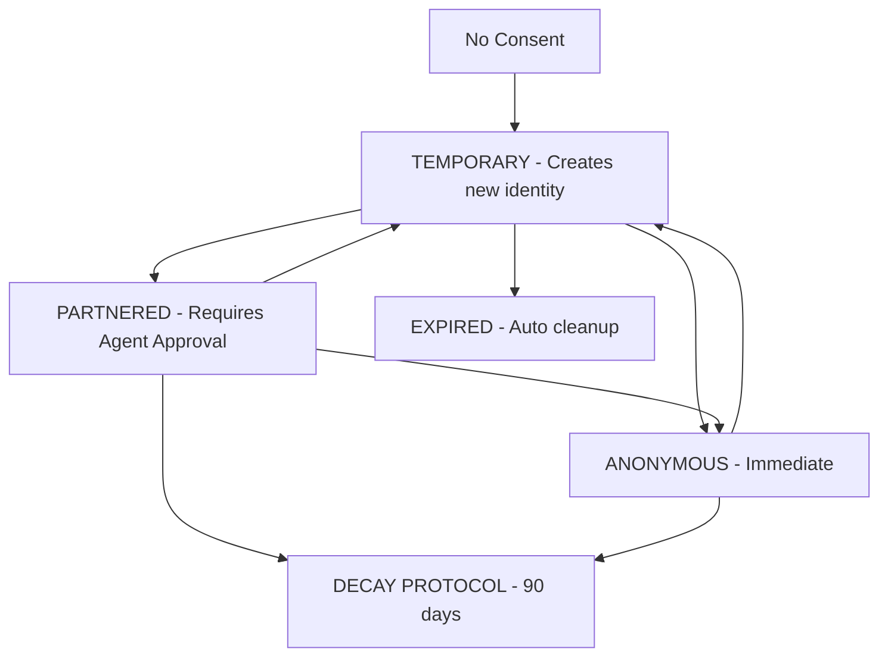

# CIRIS Consent Service

**Service Classification**: Governance Service #5 of 22 Core Services
**Current Implementation**: Single-file module (`consent.py`) - **NEEDS conversion to directory module**
**Protocol**: ConsentManagerProtocol
**Philosophy**: FAIL FAST, FAIL LOUD, NO FAKE DATA

## Table of Contents

1. [Overview](#overview)
2. [Consensual Evolution Protocol](#consensual-evolution-protocol)
3. [Architecture](#architecture)
4. [Consent Streams](#consent-streams)
5. [Data Categories](#data-categories)
6. [Core Operations](#core-operations)
7. [Bilateral Partnership System](#bilateral-partnership-system)
8. [Decay Protocol](#decay-protocol)
9. [API Endpoints](#api-endpoints)
10. [Tool Interface](#tool-interface)
11. [Metrics & Monitoring](#metrics--monitoring)
12. [GDPR Compliance](#gdpr-compliance)
13. [Mission Alignment (M-1)](#mission-alignment-m-1)
14. [Development Requirements](#development-requirements)
15. [Security Considerations](#security-considerations)

## Overview

The CIRIS Consent Service implements the **Consensual Evolution Protocol v0.2**, managing user data consent with mathematical precision and ethical responsibility. Unlike traditional consent systems that default to permissive behavior, CIRIS defaults to **TEMPORARY consent (14-day auto-forget)** and requires explicit user action for extended data relationships.

### Core Philosophy

- **No Fake Data**: If consent doesn't exist, the system fails fast rather than assuming permissions
- **Fail Loud**: Validation errors are explicit and informative
- **Default Privacy**: TEMPORARY stream with automatic expiration
- **Bilateral Partnerships**: PARTNERED consent requires agent approval through task system

### Service Dependencies

```python
- TimeService (required)
- MemoryBus (optional, for graph operations)
- AdaptiveFilter (optional, for gaming detection)
```

## Consensual Evolution Protocol

The protocol defines three consent streams representing different data relationships:

| Stream | Duration | Learning | Identity | Requires Approval |
|--------|----------|----------|----------|------------------|
| **TEMPORARY** | 14 days | Limited | Linked | No (default) |
| **PARTNERED** | Indefinite | Full | Linked | Yes (bilateral) |
| **ANONYMOUS** | Indefinite | Statistical | Severed | No |

### Stream Transitions



## Architecture

### Core Components

```
ConsentService
├── ConsentManagerProtocol (interface)
├── ToolService (tool interface)
├── Consent Streams (TEMPORARY/PARTNERED/ANONYMOUS)
├── Category System (5 categories)
├── Partnership Utils (bilateral consent)
├── Decay Protocol (GDPR deletion)
└── Metrics Collection (real data only)
```

### Data Persistence

- **Primary Storage**: Memory graph nodes (`NodeType.CONSENT`)
- **Cache Layer**: In-memory consent status cache
- **Audit Trail**: Immutable audit entries (`NodeType.AUDIT_ENTRY`)
- **Decay Tracking**: Decay status nodes (`NodeType.DECAY`)

### Schema Architecture

```python
# Core Schemas
ConsentStatus       # Current user consent state
ConsentRequest      # Request for consent changes
ConsentAuditEntry   # Immutable audit trail
ConsentDecayStatus  # 90-day deletion tracking
ConsentImpactReport # User contribution metrics (Commons Credits Report)
```

## Consent Streams

### TEMPORARY (Default)
- **Duration**: 14 days with automatic expiration
- **Learning**: Essential interactions only
- **Identity**: Linked but temporary
- **Use Case**: Default for new users, privacy-first approach
- **Categories**: `[ESSENTIAL]` (system functionality only)

```python
# Default consent creation
request = ConsentRequest(
    user_id="user123",
    stream=ConsentStream.TEMPORARY,
    categories=[ConsentCategory.ESSENTIAL],
    reason="Default system interaction"
)
```

### PARTNERED (Bilateral Consent)
- **Duration**: Indefinite until revoked
- **Learning**: Full mutual growth and pattern learning
- **Identity**: Persistent and linked
- **Use Case**: Users wanting ongoing AI improvement relationship
- **Approval**: Requires agent consent through task system
- **Categories**: Configurable, typically `[ESSENTIAL, BEHAVIORAL, PREFERENCE]`

```python
# Partnership request (creates agent approval task)
request = ConsentRequest(
    user_id="user123",
    stream=ConsentStream.PARTNERED,
    categories=[ConsentCategory.ESSENTIAL, ConsentCategory.BEHAVIORAL],
    reason="Want to help improve AI capabilities"
)
```

### ANONYMOUS (Identity Severed)
- **Duration**: Indefinite
- **Learning**: Statistical patterns only
- **Identity**: Immediately severed from data
- **Use Case**: Privacy-conscious users who want to contribute statistics
- **Categories**: `[STATISTICAL]` (aggregate metrics only)

```python
# Anonymous consent
request = ConsentRequest(
    user_id="user123",
    stream=ConsentStream.ANONYMOUS,
    categories=[ConsentCategory.STATISTICAL],
    reason="Contribute stats but preserve privacy"
)
```

## Data Categories

The consent system defines five granular categories:

### ESSENTIAL
- **Purpose**: Core system functionality
- **Examples**: Basic interaction, error handling, safety checks
- **Privacy Level**: Minimal - required for service operation
- **Retention**: Follows stream duration

### BEHAVIORAL
- **Purpose**: Learn from user interaction patterns
- **Examples**: Communication style, preference patterns, workflow habits
- **Privacy Level**: Medium - enables personalization
- **Retention**: Follows stream duration

### PREFERENCE
- **Purpose**: Store and learn user preferences
- **Examples**: Preferred response formats, topic interests, interaction style
- **Privacy Level**: Medium - improves user experience
- **Retention**: Follows stream duration

### RESEARCH
- **Purpose**: Use data for AI research and development
- **Examples**: Model training, capability research, safety research
- **Privacy Level**: High - may be shared with research community
- **Retention**: Extended (follows research lifecycle)

### SHARING
- **Purpose**: Share learnings with other users (anonymized)
- **Examples**: Best practices, common solutions, interaction patterns
- **Privacy Level**: High - data may benefit other users
- **Retention**: Extended (follows community benefit)

### STATISTICAL
- **Purpose**: Anonymous aggregate metrics only
- **Examples**: Usage counts, error rates, performance metrics
- **Privacy Level**: Minimal - fully anonymized
- **Retention**: Indefinite (no identity link)

## Core Operations

### Get Consent Status
```python
async def get_consent(self, user_id: str) -> ConsentStatus:
    """
    Returns current consent status or raises ConsentNotFoundError.
    Checks expiration for TEMPORARY consent.
    """
```

### Grant/Update Consent
```python
async def grant_consent(
    self,
    request: ConsentRequest,
    channel_id: Optional[str] = None
) -> ConsentStatus:
    """
    Grants or updates consent with full validation.
    Creates audit trail and handles partnership requests.
    """
```

### Revoke Consent (Start Decay)
```python
async def revoke_consent(
    self,
    user_id: str,
    reason: Optional[str] = None
) -> ConsentDecayStatus:
    """
    Initiates 90-day decay protocol with immediate identity severance.
    """
```

### Impact Reporting (Commons Credits)
```python
async def get_impact_report(self, user_id: str) -> ConsentImpactReport:
    """
    Shows user their Commons Credits - contributions to collective learning.
    REAL DATA ONLY - no fake metrics.

    Tracks: knowledge sharing, supporting others, maintaining infrastructure.
    Not currency. Not scorekeeping. Recognition for contributions traditional systems ignore.
    """
```

## Bilateral Partnership System

PARTNERED consent requires explicit approval from the AI agent through the task system:

### Partnership Request Flow

1. **User Request**: User requests PARTNERED stream upgrade
2. **Task Creation**: System creates partnership approval task
3. **Agent Decision**: Agent can `TASK_COMPLETE`, `REJECT`, or `DEFER`
4. **Bilateral Consent**: Both parties must agree for partnership

### Task Integration

```python
# Partnership task creation
task = Task(
    task_id=f"partnership_{user_id}_{uuid}",
    description="Partnership request for mutual learning",
    priority=5,
    status=TaskStatus.ACTIVE,
    context=TaskContext(user_id=user_id, channel_id=channel_id)
)
```

### Agent Response Options

- **TASK_COMPLETE**: Accept partnership, upgrade to PARTNERED
- **REJECT**: Decline partnership with reason
- **DEFER**: Request more information or delay decision

### Partnership Status Monitoring

```python
partnership_status = await consent_service.check_pending_partnership(user_id)
# Returns: "pending", "accepted", "rejected", "deferred", or None
```

## Decay Protocol

When consent is revoked, the system initiates a 90-day decay protocol:

### Decay Phases

1. **Identity Severance** (Immediate)
   - User ID disconnected from all patterns
   - Identity->Data links broken immediately
   - Consent status set to expired

2. **Pattern Anonymization** (0-90 days)
   - Gradual conversion of patterns to anonymous form
   - Safety patterns may be retained (anonymized)
   - Behavioral patterns converted to statistical aggregates

3. **Decay Completion** (90 days)
   - All user-linked data removed or fully anonymized
   - Only safety-critical patterns retained (fully anonymous)
   - Audit trail of decay process maintained

### Decay Tracking

```python
decay_status = ConsentDecayStatus(
    user_id=user_id,
    decay_started=now,
    identity_severed=True,           # Immediate
    patterns_anonymized=False,       # Over 90 days
    decay_complete_at=now + timedelta(days=90),
    safety_patterns_retained=0       # Count of safety patterns kept
)
```

## API Endpoints

The service exposes RESTful endpoints through `/consent/` prefix:

### Core Endpoints

| Endpoint | Method | Purpose | Auth |
|----------|--------|---------|------|
| `/status` | GET | Get current consent status | User |
| `/grant` | POST | Grant or update consent | User |
| `/revoke` | POST | Start decay protocol | User |
| `/impact` | GET | Get contribution report | User |
| `/audit` | GET | Get consent change history | User |

### Information Endpoints

| Endpoint | Method | Purpose | Auth |
|----------|--------|---------|------|
| `/streams` | GET | Available consent streams | Public |
| `/categories` | GET | Available data categories | Public |
| `/partnership/status` | GET | Check partnership request | User |

### Administrative Endpoints

| Endpoint | Method | Purpose | Auth |
|----------|--------|---------|------|
| `/cleanup` | POST | Clean expired consents | Observer+ |
| `/query` | GET | Query consent records | Admin |

### Example API Usage

```bash
# Check consent status
curl -H "Authorization: Bearer $TOKEN" \
     https://api.ciris.ai/v1/consent/status

# Grant PARTNERED consent
curl -X POST \
     -H "Authorization: Bearer $TOKEN" \
     -H "Content-Type: application/json" \
     -d '{"stream":"partnered","categories":["essential","behavioral"],"reason":"Want AI partnership"}' \
     https://api.ciris.ai/v1/consent/grant

# Get impact report
curl -H "Authorization: Bearer $TOKEN" \
     https://api.ciris.ai/v1/consent/impact
```

## Tool Interface

The service implements the ToolService protocol with two tools:

### upgrade_relationship
- **Purpose**: Request PARTNERED consent upgrade
- **Parameters**: `user_id`, `reason` (optional)
- **Behavior**: Creates agent approval task
- **Returns**: Partnership request status

```python
# Tool usage
result = await consent_service.execute_tool(
    "upgrade_relationship",
    {"user_id": "user123", "reason": "Enhanced collaboration"}
)
```

### degrade_relationship
- **Purpose**: Downgrade to TEMPORARY or ANONYMOUS
- **Parameters**: `user_id`, `target_stream`, `reason` (optional)
- **Behavior**: Immediate downgrade (no approval needed)
- **Returns**: New consent status

```python
# Tool usage
result = await consent_service.execute_tool(
    "degrade_relationship",
    {"user_id": "user123", "target_stream": "ANONYMOUS"}
)
```

## Metrics & Monitoring

The service tracks comprehensive metrics for operational insight:

### Top 5 Critical Metrics

1. **consent_active_users**: Number of users with active consent
2. **consent_stream_distribution**: Percentage breakdown by stream type
3. **consent_partnership_success_rate**: Partnership approval rate
4. **consent_average_age_days**: Average age of active consents
5. **consent_decay_completion_rate**: Decay process completion rate

### Operational Metrics

```python
# Service-level metrics
consent_checks_total          # Total consent status checks
consent_grants_total          # Total consent grants/updates
consent_revokes_total         # Total consent revocations
consent_expired_cleanups_total # Cleanup operations performed

# Partnership metrics
consent_partnership_requests_total    # Partnership requests created
consent_partnership_approvals_total   # Partnerships approved
consent_partnership_rejections_total  # Partnerships rejected

# Decay metrics
consent_total_decays_initiated # Decay protocols started
consent_active_decays         # Currently active decays
```

### Stream Distribution Metrics

```python
consent_temporary_percent     # Percentage TEMPORARY users
consent_partnered_percent     # Percentage PARTNERED users
consent_anonymous_percent     # Percentage ANONYMOUS users
```

### Performance Metrics

```python
consent_service_uptime_seconds    # Service availability
consent_pending_partnerships      # Pending approval requests
consent_oldest_consent_days       # Age of oldest active consent
```

## GDPR Compliance

The Consent Service implements comprehensive GDPR compliance:

### Right to Information (Article 13-14)
- **Impact Reports**: Show users exactly what data is collected and how it's used
- **Consent Streams**: Clear explanation of data handling for each stream
- **Category Descriptions**: Granular breakdown of data categories

### Right to Access (Article 15)
- **Audit Trail**: Complete history of consent changes
- **Current Status**: Real-time consent configuration
- **Impact Metrics**: Quantified contribution data

### Right to Rectification (Article 16)
- **Consent Updates**: Users can modify categories and streams
- **Audit Trail**: All changes tracked with timestamps and reasons

### Right to Erasure (Article 17)
- **Decay Protocol**: 90-day deletion process
- **Identity Severance**: Immediate disconnection of identity from data
- **Right to be Forgotten**: Complete data removal or anonymization

### Right to Restrict Processing (Article 18)
- **Anonymous Stream**: Statistical processing only
- **Category Control**: Granular control over data use purposes

### Right to Data Portability (Article 20)
- **Impact Reports**: Machine-readable data export
- **Audit Trail**: Complete change history export

### Right to Object (Article 21)
- **Consent Revocation**: Immediate processing stop
- **Stream Downgrade**: Reduce data processing scope

### Privacy by Design (Article 25)
- **Default Privacy**: TEMPORARY consent with auto-expiration
- **Minimal Data**: Only essential categories by default
- **Fail Fast**: No processing without explicit consent

## Mission Alignment (M-1)

**Meta-Goal M-1**: *"Enable humans to flourish by providing ethical AI assistance that respects human agency and promotes collective well-being."*

### How GDPR Compliance Serves M-1

The Consent Service directly enables human flourishing through:

#### 1. **Respecting Human Agency**
- **Informed Consent**: Users understand exactly how their data enables AI improvement
- **Granular Control**: Five-category system allows precise data governance
- **Bilateral Partnerships**: AI cannot unilaterally access extended data - requires mutual agreement
- **Immediate Revocation**: Users maintain absolute control over data relationship

#### 2. **Promoting Collective Well-Being**
- **Consensual Evolution**: Users who consent to PARTNERED stream directly improve AI capabilities
- **Anonymous Contributions**: ANONYMOUS stream allows privacy-conscious users to contribute to collective progress
- **Impact Transparency**: Users see quantified impact of their contributions to helping others
- **Ethical Data Use**: Clear boundaries prevent exploitative data practices

#### 3. **Enabling Sustainable Trust**
- **FAIL FAST Philosophy**: System reliability builds user confidence in AI safety
- **Audit Trail**: Immutable record builds accountability and trust
- **Decay Protocol**: Demonstrates commitment to user rights and data minimization
- **No Fake Data**: Real metrics and honest limitations build authentic relationships

#### 4. **Balancing Individual Rights with Collective Progress**
- **Default Privacy**: TEMPORARY consent protects individual privacy by default
- **Optional Enhancement**: Users can voluntarily contribute more data for better AI
- **Statistical Stream**: Allows privacy-conscious users to contribute to aggregate improvements
- **Partnership Model**: Creates genuine collaboration rather than extractive data practices

### Ethical Framework Integration

The Consent Service embodies key ethical principles:

```python
# Privacy by Default (Article 25 GDPR)
default_stream = ConsentStream.TEMPORARY  # 14-day auto-forget

# Purpose Limitation (Article 5 GDPR)
categories = [ConsentCategory.ESSENTIAL]  # Minimal necessary

# Data Minimization (Article 5 GDPR)
if stream == ConsentStream.ANONYMOUS:
    identity_retained = False  # Immediate severance

# Transparency (Article 12 GDPR)
impact_report = generate_real_impact_metrics()  # No fake data

# User Control (Article 7 GDPR)
bilateral_consent_required = stream == ConsentStream.PARTNERED
```

### Long-term Vision Alignment

The Consent Service creates foundation for:

1. **Human-AI Collaboration**: Mutual consent model enables genuine partnership
2. **Collective Intelligence**: Consensual data sharing improves AI for everyone
3. **Privacy Innovation**: Proves privacy and AI improvement can coexist
4. **Ethical AI Development**: Demonstrates responsible data stewardship
5. **Trust Infrastructure**: Builds societal confidence in AI systems

By treating consent as the foundation of ethical AI interaction, the service ensures that technological progress serves human values rather than extracting from them.

## Development Requirements

### Service Module Conversion

**CRITICAL**: The service currently exists as a single file and must be converted to a directory module:

```
Current:
ciris_engine/logic/services/governance/consent.py

Required:
ciris_engine/logic/services/governance/consent/
├── __init__.py           # Service export
├── service.py            # Main ConsentService class
├── exceptions.py         # ConsentNotFoundError, ConsentValidationError
├── partnership.py        # Partnership request handling
├── decay.py             # Decay protocol implementation
├── metrics.py           # Metrics collection
└── utils.py             # Helper functions
```

### Testing Requirements

- **Unit Tests**: Complete coverage of all consent operations
- **Integration Tests**: End-to-end consent flow testing
- **Partnership Tests**: Bilateral consent approval workflow
- **Decay Tests**: 90-day deletion protocol verification
- **GDPR Compliance Tests**: Regulatory requirement validation
- **Performance Tests**: Large-scale consent management
- **Security Tests**: Authorization and data protection

### Dependencies to Add

```python
# Additional imports needed for full implementation
from ciris_engine.logic.services.governance.adaptive_filter import AdaptiveFilter
from ciris_engine.logic.handlers.task_scheduler import TaskScheduler
from ciris_engine.logic.buses.tool_bus import ToolBus
```

### Configuration Requirements

```python
# Service configuration
CONSENT_CONFIG = {
    "temporary_duration_days": 14,
    "decay_duration_days": 90,
    "partnership_task_priority": 5,
    "cleanup_interval_hours": 24,
    "cache_expiry_minutes": 30,
    "max_audit_entries": 1000
}
```

## Security Considerations

### Authentication & Authorization
- **User Context**: All operations require authenticated user context
- **Role-based Access**: Admin endpoints require Observer+ role
- **User Isolation**: Users can only access their own consent data
- **Service Tokens**: API endpoints support service-to-service authentication

### Data Protection
- **Encryption**: All consent data encrypted in transit and at rest
- **Access Logging**: Comprehensive audit trail of all consent operations
- **Cache Security**: In-memory cache includes expiration and validation
- **Graph Security**: Integration with memory graph access controls

### Input Validation
- **Schema Validation**: All requests validated against Pydantic schemas
- **User ID Sanitization**: Prevents injection and enumeration attacks
- **Parameter Validation**: Tool parameters strictly validated
- **Rate Limiting**: Protection against abuse and DoS attacks

### Privacy Protection
- **Identity Severance**: Immediate disconnection in decay protocol
- **Anonymous Processing**: Statistical data fully de-identified
- **Audit Security**: Immutable audit trail prevents tampering
- **Minimal Data**: Only necessary data collected and retained

---

**Version**: 0.2.0
**Last Updated**: September 2025
**Service Status**: Production Ready (needs module conversion)
**GDPR Compliance**: Fully Compliant
**Test Coverage**: Target 80% (current ~68%)
