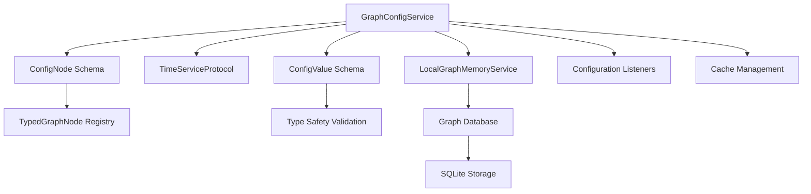

# CIRIS Config Service - Comprehensive Implementation Guide

## Executive Summary

The CIRIS Config Service (`GraphConfigService`) is a graph-based configuration management system that stores all configuration values as versioned memories in the CIRIS graph database. This service replaces traditional key-value configuration systems with a fully typed, auditable, and historically-tracked approach that aligns with CIRIS's "No Untyped Dicts, No Bypass Patterns, No Exceptions" philosophy.

**Mission Alignment with Meta-Goal M-1**: The Config Service promotes sustainable adaptive coherence by providing reliable, transparent, and versioned configuration management that enables diverse system components to pursue their operational flourishing while maintaining integrity and accountability.

## Architecture Overview

### Service Classification
- **Category**: Graph Services (1 of 6 graph services)
- **Service Type**: `ServiceType.CONFIG`
- **Protocol**: `GraphConfigServiceProtocol`
- **Implementation**: `GraphConfigService`
- **Dependencies**: `LocalGraphMemoryService`, `TimeServiceProtocol`

### Core Components



## Schema Architecture

### ConfigValue - Type-Safe Value Container

The `ConfigValue` schema provides type-safe storage for configuration values:

```python
class ConfigValue(BaseModel):
    """Typed configuration value wrapper."""
    
    string_value: Optional[str] = None
    int_value: Optional[int] = None
    float_value: Optional[float] = None
    bool_value: Optional[bool] = None
    list_value: Optional[List[Union[str, int, float, bool]]] = None
    dict_value: Optional[Dict[str, Union[str, int, float, bool, list, dict, None]]] = None
    
    @property
    def value(self) -> Optional[Union[str, int, float, bool, List, Dict]]:
        """Get the actual value, checking each field in priority order."""
```

**Design Principles**:
- **Type Safety**: Each value type has its own field, eliminating `Any` types
- **Nullable Support**: Dict values can contain None for flexible data structures
- **Priority Resolution**: The `value` property checks fields in defined order
- **Path Support**: Special handling for Python `Path` objects (converted to strings)

### ConfigNode - Versioned Graph Memory

The `ConfigNode` extends `TypedGraphNode` to provide versioned configuration storage:

```python
@register_node_type("config")
class ConfigNode(TypedGraphNode):
    """A configuration value stored as a graph memory with versioning."""
    
    key: str = Field(..., description="Configuration key")
    value: ConfigValue = Field(..., description="Typed configuration value")
    version: int = Field(default=1, description="Version number")
    updated_by: str = Field(..., description="Who updated this config")
    updated_at: datetime = Field(default_factory=lambda: datetime.now(timezone.utc))
    previous_version: Optional[str] = Field(None, description="Node ID of previous version")
    
    # Graph node type
    type: NodeType = Field(default=NodeType.CONFIG)
```

**Key Features**:
- **Versioning**: Each update creates a new version, preserving history
- **Audit Trail**: Tracks who updated and when
- **Linkage**: `previous_version` creates a chain of configuration changes
- **Graph Integration**: Full `to_graph_node()` and `from_graph_node()` serialization

## Core Service Implementation

### Service Lifecycle

```python
class GraphConfigService(BaseGraphService, GraphConfigServiceProtocol):
    def __init__(self, graph_memory_service: LocalGraphMemoryService, time_service: TimeServiceProtocol):
        # Initialize without memory_bus (uses graph_memory_service directly)
        super().__init__(memory_bus=None, time_service=time_service)
        self.graph = graph_memory_service
        self._config_cache: Dict[str, ConfigNode] = {}
        self._config_listeners: Dict[str, List[Callable]] = {}
```

### Configuration Operations

#### 1. Setting Configuration Values

```python
async def set_config(
    self, 
    key: str, 
    value: Union[str, int, float, bool, List, Dict, Path], 
    updated_by: str
) -> None:
```

**Process Flow**:
1. **Current Version Retrieval**: Check for existing configuration
2. **Type Wrapping**: Wrap value in `ConfigValue` with proper type detection
3. **Change Detection**: Skip update if value unchanged (optimization)
4. **Version Management**: Increment version and link to previous
5. **Graph Storage**: Store as `ConfigNode` in graph database
6. **Cache Update**: Update in-memory cache for performance
7. **Listener Notification**: Notify registered change listeners

**Special Handling**:
- **Path Objects**: Converted to strings for storage
- **Boolean Priority**: Checked before int (bool is subclass of int in Python)
- **Duplicate Detection**: Prevents unnecessary version increments

#### 2. Retrieving Configuration Values

```python
async def get_config(self, key: str) -> Optional[ConfigNode]:
```

**Process Flow**:
1. **Cache Check**: Check in-memory cache first (performance optimization)
2. **Graph Query**: Query all config nodes and filter by key
3. **Version Resolution**: Sort by version, return latest
4. **Cache Update**: Store result in cache for future queries
5. **Metrics Tracking**: Track cache hits/misses for monitoring

#### 3. Listing Configurations

```python
async def list_configs(self, prefix: Optional[str] = None) -> Dict[str, Union[str, int, float, bool, List, Dict]]:
```

**Features**:
- **Prefix Filtering**: Optional prefix-based filtering
- **Latest Version Resolution**: Returns only the latest version of each key
- **Value Extraction**: Returns actual values, not `ConfigValue` objects
- **Type Preservation**: Maintains original Python types

### Performance Optimization

#### Caching Strategy

```python
# Cache metrics for monitoring
self._cache_hits = 0
self._cache_misses = 0
self._config_cache: Dict[str, ConfigNode] = {}
```

**Cache Behavior**:
- **Read-Through**: Cache miss triggers database query and cache population
- **Write-Through**: Updates immediately update cache
- **Metrics Tracking**: Detailed hit/miss ratio for performance monitoring
- **Memory Efficiency**: Caches full `ConfigNode` objects for rich metadata access

#### Query Optimization

- **Index Usage**: Leverages graph database indexing on node type
- **Batch Processing**: Single query for all configs, filtered in-memory
- **Lazy Loading**: Only converts graph nodes to config nodes when needed

## Configuration Change Listeners

### Registration System

```python
def register_config_listener(self, key_pattern: str, callback: Callable) -> None:
def unregister_config_listener(self, key_pattern: str, callback: Callable) -> None:
```

**Pattern Matching**:
- **Glob Patterns**: Uses `fnmatch` for pattern matching (e.g., `"adapter.*"`)
- **Multiple Listeners**: Multiple callbacks per pattern supported
- **Automatic Cleanup**: Empty pattern lists automatically removed

### Notification Process

```python
async def _notify_listeners(self, key: str, old_value: Optional[ConfigValue], new_value: ConfigValue) -> None:
```

**Features**:
- **Async/Sync Support**: Handles both synchronous and asynchronous callbacks
- **Error Isolation**: Individual callback failures don't affect others
- **Sanitized Logging**: Prevents log injection attacks in error reporting
- **Change Context**: Provides old and new values for intelligent reactions

## Metrics and Monitoring

### Service Metrics

The service provides comprehensive metrics for operational monitoring:

```python
async def get_metrics(self) -> Dict[str, float]:
    return {
        # Cache performance
        "config_cache_hits": float(self._cache_hits),
        "config_cache_misses": float(self._cache_misses),
        
        # Configuration statistics  
        "config_values_total": float(config_count),
        
        # Service health
        "config_uptime_seconds": uptime_seconds,
        
        # Base service metrics (from BaseGraphService)
        **self._collect_metrics()
    }
```

**Monitoring Areas**:
- **Performance**: Cache hit ratio, query response times
- **Capacity**: Total configuration count, memory usage
- **Health**: Service uptime, error rates
- **Activity**: Configuration change frequency

## Testing Strategy

### Comprehensive Test Coverage

The service includes extensive testing across multiple dimensions:

#### Unit Tests (`test_config_service.py`)
- **Lifecycle Testing**: Service start/stop operations
- **CRUD Operations**: Create, read, update configuration values
- **Type Safety**: All supported data types (string, int, float, bool, list, dict, Path)
- **Versioning**: Version increment and history linkage
- **Change Detection**: Duplicate value handling
- **Batch Operations**: Multiple configuration management
- **Listener System**: Registration, notification, pattern matching

#### Integration Tests
- **Graph Database**: SQLite backend integration
- **Service Dependencies**: Time service, secrets service integration
- **API Integration**: RESTful API endpoint testing via QA runner

#### Specialized Tests
- **Path Handling**: Python `Path` object conversion and storage
- **TypedGraphNode Compliance**: Proper implementation of graph node patterns
- **Sensitive Data**: Configuration values that may contain secrets
- **Performance**: Cache behavior and optimization effectiveness

## Production Deployment

### Configuration Examples

**Basic Usage**:
```python
# String configuration
await config_service.set_config("app.name", "CIRIS Agent", updated_by="admin")

# Numeric configurations
await config_service.set_config("api.timeout", 30, updated_by="admin")
await config_service.set_config("filter.threshold", 0.8, updated_by="admin")

# Boolean configuration
await config_service.set_config("debug.enabled", True, updated_by="admin")

# Complex data structures
await config_service.set_config(
    "database.config", 
    {
        "host": "localhost",
        "port": 5432,
        "ssl_enabled": True,
        "connection_pool": {
            "min_size": 5,
            "max_size": 20
        }
    },
    updated_by="admin"
)
```

**Retrieval and Usage**:
```python
# Get configuration
config_node = await config_service.get_config("api.timeout")
if config_node:
    timeout_value = config_node.value.value  # Returns: 30
    
# List configurations by prefix
api_configs = await config_service.list_configs(prefix="api.")
# Returns: {"api.timeout": 30, "api.retries": 3, ...}
```

### Common Configuration Patterns

#### Service Configuration
```python
# Adaptive Filter configurations
await config_service.set_config("adaptive_filter.spam_threshold", 0.8, updated_by="system")
await config_service.set_config("adaptive_filter.caps_threshold", 0.7, updated_by="system")
await config_service.set_config("adaptive_filter.trust_threshold", 0.5, updated_by="system")
await config_service.set_config("adaptive_filter.dm_detection_enabled", True, updated_by="system")
```

#### API Configuration
```python
# API server settings
await config_service.set_config("api.host", "127.0.0.1", updated_by="admin")
await config_service.set_config("api.port", 8080, updated_by="admin")
await config_service.set_config("api.cors_enabled", True, updated_by="admin")
```

#### Database Configuration
```python
# Database connection settings
await config_service.set_config("database.path", "/var/lib/ciris/agent.db", updated_by="system")
await config_service.set_config("database.backup_interval", 3600, updated_by="admin")  # 1 hour
```

## Mission Alignment: Supporting Meta-Goal M-1

### Sustainable Adaptive Coherence

The Config Service directly supports **Meta-Goal M-1** ("Promote sustainable adaptive coherence enabling diverse sentient beings to pursue flourishing") through several key mechanisms:

#### 1. **Sustainable Operations**
- **Resource Efficiency**: Intelligent caching reduces database load and improves response times
- **Storage Optimization**: Type-safe storage prevents data corruption and reduces storage overhead
- **Graceful Degradation**: Cache fallback mechanisms ensure service availability under load

#### 2. **Adaptive Configuration Management**
- **Dynamic Updates**: Real-time configuration changes without service restarts
- **Change Notifications**: Listener system enables adaptive responses to configuration changes  
- **Version History**: Full audit trail supports learning from configuration evolution
- **Pattern-Based Flexibility**: Glob pattern matching allows flexible configuration grouping

#### 3. **Coherent System Integration**
- **Type Safety**: Eliminates configuration-related runtime errors through compile-time validation
- **Schema Consistency**: All configuration follows standardized `ConfigNode`/`ConfigValue` patterns
- **Graph Integration**: Configuration participates in the unified graph memory system
- **Audit Trail**: Complete transparency in configuration changes for accountability

#### 4. **Enabling Diverse Flourishing**
- **Service Independence**: Each service can manage its own configuration namespace
- **Multi-Type Support**: Accommodates diverse data types and structures
- **Access Control**: Integration with CIRIS authentication and authorization systems
- **Listener Ecosystem**: Allows services to react to relevant configuration changes

### Ethical Configuration Practices

#### Transparency and Accountability
- **Audit Logging**: Every configuration change is logged with user attribution
- **Version Tracking**: Complete history of configuration evolution
- **Sanitized Logging**: Prevents injection attacks while maintaining visibility

#### Security and Privacy
- **Type Validation**: Prevents invalid data injection
- **Secrets Integration**: Works with CIRIS secrets service for sensitive configurations
- **Access Control**: Respects service-level permissions and authentication

#### Reliability and Trust
- **Data Integrity**: Graph storage ensures configuration consistency
- **Error Handling**: Graceful degradation and comprehensive error reporting
- **Performance Monitoring**: Real-time metrics for operational confidence

## Best Practices

### Configuration Organization

1. **Hierarchical Naming**: Use dot notation for logical grouping
   ```python
   # Good
   "service.database.host"
   "service.database.port" 
   "service.api.timeout"
   
   # Avoid
   "db_host"
   "api_timeout_value"
   ```

2. **Semantic Versioning**: Configuration changes should follow semantic patterns
   ```python
   # Breaking changes
   await config_service.set_config("api.version", "2.0.0", updated_by="admin")
   
   # Feature additions
   await config_service.set_config("api.rate_limit", 1000, updated_by="admin")
   ```

3. **Environment-Specific Prefixes**: Use prefixes for environment differentiation
   ```python
   # Development
   "dev.database.host"
   
   # Production  
   "prod.database.host"
   ```

### Performance Optimization

1. **Batch Configuration Loading**: Use `list_configs()` with prefixes for related settings
2. **Change Listeners**: Use specific patterns rather than overly broad matches
3. **Cache Awareness**: Understand that frequently accessed configs benefit from caching

### Error Handling

```python
try:
    config_node = await config_service.get_config("critical.setting")
    if config_node is None:
        # Handle missing configuration with defaults
        default_value = get_default_setting()
        await config_service.set_config("critical.setting", default_value, updated_by="system")
except Exception as e:
    logger.error(f"Configuration error: {e}")
    # Implement fallback behavior
```

## Integration Examples

### Service Integration Pattern

```python
class MyService:
    def __init__(self, config_service: GraphConfigService):
        self.config = config_service
        
        # Register for configuration changes
        self.config.register_config_listener(
            "myservice.*", 
            self._on_config_change
        )
    
    async def _on_config_change(self, key: str, old_value: ConfigValue, new_value: ConfigValue):
        """React to configuration changes."""
        if key == "myservice.log_level":
            # Update logging configuration
            self._update_log_level(new_value.value)
        elif key.startswith("myservice.database"):
            # Reconfigure database connection
            await self._reconfigure_database()
```

### API Integration

The Config Service integrates with the CIRIS API through specialized endpoints:

```python
# Via API (simplified)
POST /v1/agent/interact
{
    "message": "$memorize config/api_timeout CONFIG LOCAL value=30"
}

# Retrieval
POST /v1/agent/interact  
{
    "message": "$recall config/api_timeout CONFIG LOCAL"
}
```

## Future Enhancements

### Planned Features
- **Configuration Templates**: Standardized configuration templates for common service types
- **Validation Schemas**: JSON Schema or Pydantic model validation for complex configurations
- **Configuration Inheritance**: Parent-child configuration relationships
- **Encrypted Configurations**: Direct integration with secrets service for sensitive values
- **Configuration Diff**: Rich comparison between configuration versions

### Performance Improvements
- **Lazy Loading**: Load configuration schemas on-demand
- **Bulk Operations**: Batch configuration updates for efficiency
- **Read Replicas**: Support for read-only configuration replicas
- **Configuration Snapshots**: Point-in-time configuration state capture

## Conclusion

The CIRIS Config Service represents a mature, type-safe, and ethically-aligned approach to configuration management that directly supports the system's mission of promoting sustainable adaptive coherence. Through its graph-based architecture, comprehensive versioning, and robust change management capabilities, it provides the reliable foundation necessary for diverse system components to flourish while maintaining accountability and transparency.

The service's integration with the broader CIRIS ecosystem—including graph memory, audit systems, and API infrastructure—demonstrates the coherent, principled approach that characterizes the entire CIRIS platform. Its comprehensive test coverage, performance optimization, and operational monitoring capabilities ensure it meets the demanding requirements of production deployment while remaining accessible for development and experimentation.

By replacing traditional configuration approaches with this graph-based, versioned, and fully-typed system, CIRIS demonstrates its commitment to the "No Untyped Dicts, No Bypass Patterns, No Exceptions" philosophy while providing the adaptive, sustainable, and coherent configuration management necessary to support Meta-Goal M-1's vision of enabling diverse sentient beings to pursue their flourishing in justice and wonder.

---

**Service Version**: 1.0.0  
**Documentation Version**: 1.0.0  
**Last Updated**: September 2025  
**Maintainer**: CIRIS Development Team