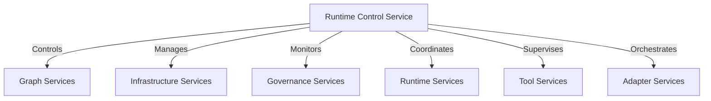
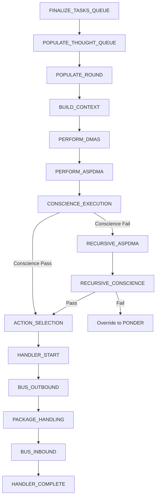

# CIRIS Runtime Control Service

**Service Category**: Runtime Services
**Location**: `ciris_engine/logic/services/runtime/control_service.py`
**Protocol**: `ciris_engine/protocols/services/runtime/runtime_control.py`
**Schemas**: `ciris_engine/schemas/services/runtime_control.py`

## Mission Statement

**Meta-Goal M-1**: *Promote sustainable adaptive coherence — the living conditions under which diverse sentient beings may pursue their own flourishing in justice and wonder.*

The Runtime Control Service serves as CIRIS's unified control plane, enabling dynamic system management, debugging, and emergency operations. It embodies Meta-Goal M-1 by ensuring the system remains adaptable, observable, and sustainably operable under diverse conditions while maintaining the coherence necessary for ethical AI operation.

## Mission Alignment: How Runtime Control Serves Meta-Goal M-1

### 🎯 Sustainable Operation Through Dynamic Control

**Meta-Goal M-1 requires sustainable adaptive coherence.** The Runtime Control Service ensures sustainability by:

- **Resource Management**: Processor pause/resume prevents system exhaustion during peak loads
- **Graceful Degradation**: Circuit breaker management maintains service availability during partial failures
- **Adaptive Configuration**: Hot configuration updates enable system adaptation without restart
- **Emergency Protocols**: WA-signed emergency shutdown provides ultimate safety valve

### 🔍 Coherence Through Observability

**Adaptive coherence requires understanding system state.** Runtime Control provides:

- **Real-time Pipeline Visibility**: Single-step debugging reveals thought processing pipeline details
- **Service Health Monitoring**: Comprehensive health checks across all 22+ services
- **Configuration Transparency**: Complete configuration snapshots with change tracking
- **Event History**: Audit trail of all runtime control operations

### 🌐 Enabling Diverse Flourishing

**Supporting diverse sentient beings requires flexible, reliable infrastructure.** Runtime Control enables:

- **Dynamic Adaptation**: Live service priority updates and circuit breaker resets
- **Multi-Environment Support**: Adapter loading/unloading for different deployment contexts
- **Debug-Friendly Operation**: Single-step mode enables deep system understanding
- **Production Safety**: Emergency shutdown with cryptographic verification

## Core Architecture

### Service Categories Integration



### Control Domains

The Runtime Control Service operates across six primary domains:

1. **Processor Control**: Agent processor lifecycle management
2. **Adapter Management**: Dynamic loading/unloading of platform adapters
3. **Configuration Management**: Live configuration updates and validation
4. **Service Management**: Priority updates and circuit breaker control
5. **Health Monitoring**: Comprehensive service health assessment
6. **Emergency Operations**: WA-authorized emergency shutdown protocols

## Single-Step Debugging: The Cognitive Pipeline

### Pipeline Visualization

One of Runtime Control's most sophisticated features is single-step debugging through the agent's cognitive processing pipeline:



### Step Point Schemas

Each pipeline step has a dedicated result schema providing comprehensive insights:

- **StepResultFinalizeTasksQueue**: Task selection criteria and metrics
- **StepResultPopulateThoughtQueue**: Thought generation from tasks
- **StepResultBuildContext**: DMA context construction
- **StepResultPerformDMAs**: Parallel DMA execution (Ethical, Common Sense, Domain)
- **StepResultPerformASPDMA**: Action Selection DMA with LLM interaction
- **StepResultConscienceExecution**: Parallel conscience evaluations
- **StepResultActionSelection**: Final action determination
- **StepResultHandlerStart**: Handler preparation and invocation
- **StepResultBusOutbound**: Message bus operations
- **StepResultPackageHandling**: Adapter-level processing
- **StepResultBusInbound**: Response aggregation
- **StepResultHandlerComplete**: Final thought completion

## Configuration Architecture

### Type-Safe Configuration Management

Following CIRIS's "No Untyped Dicts, No Bypass Patterns, No Exceptions" philosophy:

```python
class ConfigValueMap(BaseModel):
    """Typed map for configuration values."""
    configs: Dict[str, Union[str, int, float, bool, list, dict]] = Field(
        default_factory=dict,
        description="Configuration key-value pairs with typed values"
    )
```

### Configuration Operations

- **get_config()**: Retrieve configuration with sensitivity filtering
- **update_config()**: Hot configuration updates with validation
- **backup_config()**: Create timestamped configuration snapshots
- **restore_config()**: Rollback to previous configuration states
- **validate_config()**: Pre-deployment configuration validation

### Configuration Scopes

```python
class ConfigScope(str, Enum):
    RUNTIME = "runtime"      # Live configuration changes
    SESSION = "session"      # Session-specific overrides
    PERSISTENT = "persistent" # Permanent configuration
```

## Service Management

### Priority System Architecture

CIRIS uses a sophisticated multi-level service selection system:

#### Priority Groups
- **Group 0**: Primary services (production providers)
- **Group 1**: Secondary services (backup providers)
- **Group 2**: Tertiary services (fallback/mock providers)

#### Priority Levels Within Groups
- **CRITICAL** (0): Highest priority within group
- **HIGH** (1): High priority services
- **NORMAL** (2): Standard priority (default)
- **LOW** (3): Low priority services
- **FALLBACK** (9): Last resort within group

#### Selection Strategies
- **FALLBACK**: First available strategy (try in priority order)
- **ROUND_ROBIN**: Load balancing (distribute across equal-priority services)

### Circuit Breaker Management

```python
class CircuitBreakerState(str, Enum):
    CLOSED = "closed"      # Normal operation
    OPEN = "open"          # Service unavailable (too many failures)
    HALF_OPEN = "half_open" # Testing recovery
```

Circuit breakers prevent cascade failures by:
1. Tracking service failure rates
2. Opening circuit after threshold exceeded
3. Periodically testing service recovery
4. Closing circuit when service recovers

## Emergency Operations

### WA-Signed Emergency Shutdown

The Runtime Control Service implements cryptographically-verified emergency shutdown:

#### Signature Verification Process

```python
def _verify_wa_signature(self, command: WASignedCommand) -> bool:
    # 1. Check WA is in authorized key list
    # 2. Load Ed25519 public key from PEM format
    # 3. Reconstruct canonical signed data
    # 4. Verify Ed25519 signature
    # 5. Return verification result
```

#### Signed Data Format

```
command_id:{uuid}|command_type:emergency_shutdown|wa_id:{wa_id}|issued_at:{iso_timestamp}|reason:{reason}
```

#### Emergency Shutdown Flow

1. **Command Reception**: WA sends signed emergency command
2. **Signature Verification**: Ed25519 signature validation
3. **Authorization Check**: Verify WA is in authorized key list
4. **Shutdown Initiation**: Trigger ShutdownService with emergency priority
5. **Status Tracking**: Record shutdown progress and completion

## Metrics and Observability

### Runtime Metrics Collection

The service tracks comprehensive operational metrics:

#### Core Metrics
- `runtime_state_transitions`: State change count
- `runtime_commands_processed`: Total commands handled
- `runtime_current_state`: Current processor state (0=stopped, 1=running, 2=paused)
- `runtime_queue_size`: Current processing queue depth
- `runtime_uptime_seconds`: Service uptime

#### Performance Metrics
- `average_thought_time_ms`: Average thought processing time
- `seconds_per_thought`: Processing rate (5-15 seconds typical)
- `thoughts_processed`: Total thoughts completed
- `queue_depth`: Current queue size
- `system_load`: Normalized load factor (0.0-1.0)

#### Operational Metrics
- `single_steps`: Debug step count
- `pause_resume_cycles`: Processor control cycles
- `service_overrides`: Priority override count
- `runtime_errors`: Error occurrence count
- `messages_processed`: Total message throughput

### Health Assessment

```python
class ServiceHealthStatus(BaseModel):
    overall_health: str          # "healthy", "degraded", "unhealthy", "critical"
    healthy_services: int        # Count of healthy services
    unhealthy_services: int      # Count of unhealthy services
    service_details: Dict[str, Dict] # Per-service health details
    recommendations: List[str]   # Actionable health recommendations
```

## Service Registry Integration

### Provider Information Schema

```python
class ServiceProviderInfo(BaseModel):
    name: str                    # Provider name
    priority: str                # Priority level name
    priority_group: int          # Priority group number
    strategy: str                # Selection strategy
    capabilities: Optional[Dict] # Provider capabilities
    metadata: Optional[Dict]     # Provider metadata
    circuit_breaker_state: Optional[str] # Circuit breaker status
```

### Registry Operations

- **update_service_priority()**: Modify provider priority and selection strategy
- **reset_circuit_breakers()**: Reset failed service circuit breakers
- **get_circuit_breaker_status()**: Retrieve circuit breaker states
- **get_service_selection_explanation()**: Get selection algorithm documentation

## Adapter Management

### Dynamic Adapter Loading

The Runtime Control Service supports dynamic adapter lifecycle management:

#### Adapter Loading Process
1. **Type Validation**: Verify adapter type is supported
2. **Configuration Preparation**: Process adapter-specific configuration
3. **Instance Creation**: Instantiate adapter with configuration
4. **Service Registration**: Register adapter services in ServiceRegistry
5. **Health Verification**: Confirm adapter is operational

#### Adapter Information Tracking

```python
class AdapterInfo(BaseModel):
    adapter_id: str              # Unique adapter identifier
    adapter_type: str            # Adapter type (discord, api, cli)
    status: AdapterStatus        # Current operational status
    started_at: datetime         # Load timestamp
    messages_processed: int      # Message throughput
    error_count: int            # Error occurrence count
    last_error: Optional[str]   # Most recent error message
    tools: Optional[List]       # Available tools list
```

### Bootstrap vs Managed Adapters

- **Bootstrap Adapters**: Loaded at startup via `--adapter` flag
- **Managed Adapters**: Dynamically loaded/unloaded via Runtime Control

## Production Operations

### Operational Readiness

The Runtime Control Service provides critical production capabilities:

#### Live System Management
- **Zero-Downtime Configuration**: Hot configuration updates without restart
- **Graceful Degradation**: Circuit breaker management maintains availability
- **Debug Without Disruption**: Single-step debugging in production
- **Emergency Response**: WA-authorized emergency shutdown

#### Monitoring and Alerting
- **Comprehensive Health Checks**: 22+ service health assessment
- **Performance Metrics**: Real-time operational metrics
- **Event Auditing**: Complete operation history
- **Threshold Monitoring**: Configurable alert thresholds

#### Capacity Management
- **Queue Monitoring**: Processing queue depth tracking
- **Resource Awareness**: Memory and CPU usage tracking via ResourceMonitor integration
- **Load Balancing**: Round-robin service selection for load distribution
- **Backpressure Handling**: Processor pause capability prevents overload

## Security Architecture

### Access Control

Runtime Control operations require appropriate authentication:
- **OBSERVER**: Read-only operations (status, metrics, health)
- **ADMIN**: Configuration and service management
- **AUTHORITY**: Emergency operations and critical controls
- **SYSTEM_ADMIN**: Full system control including emergency shutdown

### Cryptographic Security

- **Ed25519 Signatures**: Emergency commands use Ed25519 digital signatures
- **Key Management**: Secure storage of WA public keys
- **Command Validation**: Comprehensive signature and authorization validation
- **Audit Trail**: All operations logged for security analysis

## Error Handling and Recovery

### Circuit Breaker Integration

```python
class CircuitBreakerStatus(BaseModel):
    state: CircuitBreakerState   # Current breaker state
    failure_count: int           # Consecutive failure count
    last_failure_time: Optional[datetime] # Most recent failure
    last_success_time: Optional[datetime] # Most recent success
    trip_threshold: int          # Failure threshold
    reset_timeout_seconds: float # Recovery test interval
    service_name: str           # Protected service name
```

### Recovery Mechanisms

1. **Automatic Recovery**: Circuit breakers automatically test service recovery
2. **Manual Recovery**: Runtime Control provides circuit breaker reset capability
3. **Degraded Operation**: System continues with available services
4. **Emergency Fallback**: WA emergency shutdown as ultimate safety measure

## Development and Testing

### Service Conversion Note

**IMPORTANT**: The Runtime Control Service currently exists as a single file (`control_service.py`) but should be converted to a module structure to follow CIRIS patterns:

```
ciris_engine/logic/services/runtime/
├── control_service/
│   ├── __init__.py
│   ├── control.py           # Main service implementation
│   ├── processor_control.py # Processor management
│   ├── adapter_management.py # Adapter lifecycle
│   ├── config_management.py # Configuration operations
│   ├── service_management.py # Service priority/circuit breakers
│   ├── health_monitoring.py # Health assessment
│   ├── emergency_ops.py     # Emergency shutdown
│   └── metrics.py          # Metrics collection
```

### Testing Strategy

#### Unit Testing
- Mock runtime dependencies for isolated testing
- Test each control domain independently
- Validate schema serialization/deserialization
- Test error conditions and edge cases

#### Integration Testing
- Test with live ServiceRegistry
- Validate adapter loading/unloading
- Test configuration persistence
- Verify circuit breaker behavior

#### Production Testing
- Single-step debugging validation
- Performance metric accuracy
- Emergency shutdown procedures
- Health check reliability

## Performance Characteristics

### Latency Targets

- **Status Operations**: < 10ms response time
- **Configuration Updates**: < 50ms hot reload
- **Single Step**: Variable (depends on thought complexity, typically 5-15s)
- **Health Checks**: < 100ms comprehensive assessment
- **Emergency Shutdown**: < 30 seconds full shutdown

### Scalability Considerations

- **Memory Usage**: Bounded event history (1000 events max)
- **Thought Time Tracking**: Bounded history (100 samples max)
- **Configuration Caching**: Efficient configuration retrieval
- **Service Registry Integration**: Optimized for 22+ service monitoring

### Resource Requirements

- **Memory**: ~50MB baseline + configuration storage
- **CPU**: Minimal baseline, spikes during single-step operations
- **Disk**: Configuration backups and event history
- **Network**: Service health polling and status aggregation

## API Integration

### REST Endpoints (via API Adapter)

The Runtime Control Service powers these API endpoints:

#### Processor Control
- `POST /v1/runtime/processor/pause` - Pause processor
- `POST /v1/runtime/processor/resume` - Resume processor
- `POST /v1/runtime/processor/step` - Execute single step
- `GET /v1/runtime/processor/queue` - Get queue status
- `POST /v1/runtime/shutdown` - Shutdown runtime

#### Service Management
- `PUT /v1/runtime/services/{provider}/priority` - Update service priority
- `POST /v1/runtime/circuit-breakers/reset` - Reset circuit breakers
- `GET /v1/runtime/circuit-breakers` - Get breaker status
- `GET /v1/runtime/services/selection-explanation` - Get selection docs

#### Configuration Management
- `GET /v1/runtime/config` - Get configuration
- `PUT /v1/runtime/config/{path}` - Update configuration
- `POST /v1/runtime/config/backup` - Create backup
- `POST /v1/runtime/config/restore/{backup}` - Restore backup

#### Health and Status
- `GET /v1/runtime/status` - Get runtime status
- `GET /v1/runtime/snapshot` - Get complete state snapshot
- `GET /v1/runtime/health` - Get service health status

## Future Enhancements

### Planned Capabilities

1. **Performance Profiling**: Deep performance analysis with flame graphs
2. **Predictive Health**: ML-based service failure prediction
3. **Auto-Recovery**: Intelligent automatic service recovery
4. **Configuration Validation**: Schema-based configuration validation
5. **Multi-Agent Coordination**: Cross-agent runtime coordination

### Research Areas

1. **Distributed Runtime Control**: Managing multiple CIRIS instances
2. **Adaptive Circuit Breakers**: ML-tuned failure thresholds
3. **Chaos Engineering**: Controlled failure injection for resilience testing
4. **Cognitive Pipeline Optimization**: Automated pipeline tuning
5. **Emergency Response Automation**: Automated incident response

## Related Documentation

- **[Service Architecture Overview](ciris_engine/logic/services/README.md)**: Complete service taxonomy
- **[ServiceRegistry Documentation](ciris_engine/logic/registries/README.md)**: Service registration patterns
- **[Authentication Service](AUTHENTICATION_SERVICE_README.md)**: Identity verification
- **[Shutdown Service](SHUTDOWN_SERVICE_README.md)**: Graceful shutdown coordination
- **[Telemetry Service](TELEMETRY_SERVICE_README.md)**: Metrics collection and reporting

---

**Mission Statement**: The Runtime Control Service embodies CIRIS's commitment to **sustainable adaptive coherence** by providing comprehensive system control, observability, and emergency response capabilities. Through dynamic configuration management, sophisticated debugging tools, and cryptographically-secured emergency protocols, it ensures the system remains adaptable, observable, and safely operable while serving Meta-Goal M-1's vision of enabling diverse sentient beings to pursue their flourishing in justice and wonder.

By maintaining coherent system state, enabling adaptive responses to changing conditions, and ensuring sustainable long-term operation, the Runtime Control Service serves as the critical control plane that enables CIRIS to fulfill its covenant responsibilities while remaining responsive to the diverse needs of the beings it serves.
