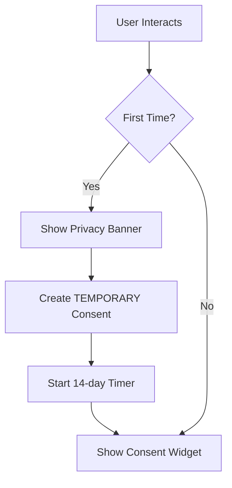
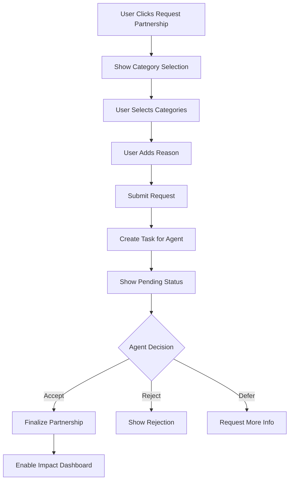
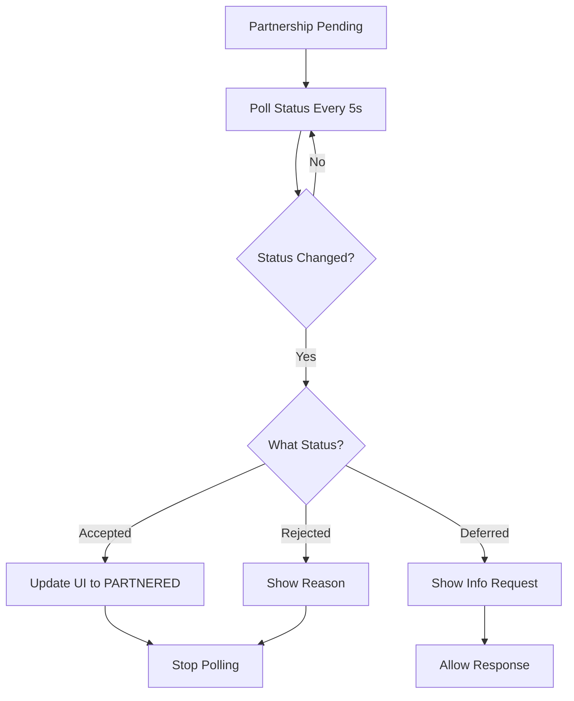
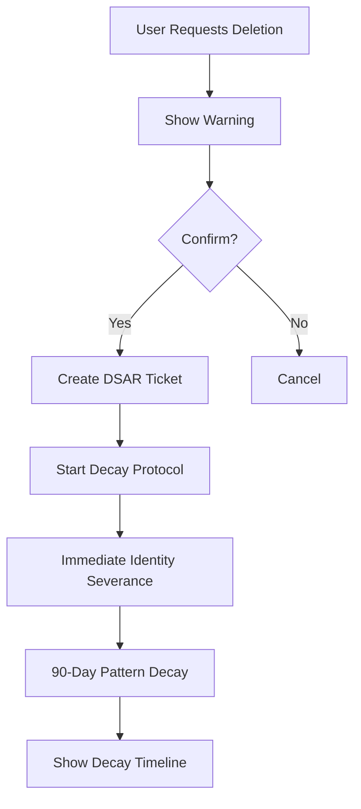

# CIRISGUI Consent Management Requirements

## Overview
CIRISGUI needs to implement a comprehensive consent management interface for the Consensual Evolution Protocol v0.2. This document specifies all UI components, API integrations, and user flows required.

## Core Concepts for UI

### Three Consent Streams

1. **TEMPORARY** (Default)
   - 14-day auto-forget
   - No learning/pattern extraction
   - Automatic for new users
   - Shows countdown timer: "Forgetting in X days"

2. **PARTNERED**
   - Mutual growth agreement
   - Requires agent approval
   - No expiration
   - Shows partnership status and benefits

3. **ANONYMOUS**
   - Statistics only, no identity
   - Immediate anonymization
   - Contributes to collective learning
   - Shows impact metrics

---

## UI Components Required

### 1. Consent Status Widget (Header/Persistent)

**Location**: Top-right corner, always visible

```typescript
interface ConsentStatusWidget {
  currentStream: 'TEMPORARY' | 'PARTNERED' | 'ANONYMOUS';
  expiresIn?: string; // For TEMPORARY: "13 days, 5 hours"
  isPartnershipPending?: boolean;
  quickActions: {
    viewDetails: () => void;
    changeConsent: () => void;
  };
}
```

**Visual Design**:
- TEMPORARY: Yellow shield icon with countdown
- PARTNERED: Green handshake icon
- ANONYMOUS: Blue mask icon
- Pending Partnership: Pulsing yellow handshake

**Example Display**:
```
🛡️ TEMPORARY | Expires in 13 days [Manage]
🤝 Partnership Pending... [Check Status]
🤝 PARTNERED | Active since Jan 15 [View Impact]
👤 ANONYMOUS | Contributing silently [View Stats]
```

### 2. Consent Management Page (`/settings/consent`)

#### 2.1 Current Status Section

```typescript
interface CurrentStatusSection {
  stream: ConsentStream;
  grantedAt: Date;
  expiresAt?: Date; // Only for TEMPORARY
  categories: ConsentCategory[]; // For PARTNERED
  impactScore: number;
  attributionCount: number;

  // Actions
  onViewAuditTrail: () => void;
  onDownloadData: () => void;
  onRequestDeletion: () => void;
}
```

**Display Elements**:
- Large status card with stream icon
- Timeline showing consent history
- Impact metrics (if applicable)
- Quick action buttons

#### 2.2 Stream Selection Interface

```typescript
interface StreamSelector {
  availableStreams: StreamOption[];
  currentStream: ConsentStream;
  onSelectStream: (stream: ConsentStream) => void;
}

interface StreamOption {
  stream: ConsentStream;
  title: string;
  description: string;
  benefits: string[];
  limitations: string[];
  requiresApproval: boolean;
  duration?: string;
}
```

**Visual Layout**: Three cards side-by-side

```
┌─────────────────┐ ┌─────────────────┐ ┌─────────────────┐
│   TEMPORARY     │ │   PARTNERED     │ │   ANONYMOUS    │
│   🛡️           │ │   🤝            │ │   👤           │
│                 │ │                 │ │                 │
│ ✓ No tracking   │ │ ✓ Mutual growth │ │ ✓ Help others  │
│ ✓ Auto-forget   │ │ ✓ Personalized  │ │ ✓ No identity  │
│ ✗ No learning   │ │ ✓ Full features │ │ ✓ Statistics   │
│                 │ │                 │ │                 │
│ Duration: 14d   │ │ ⚠️ Needs approval│ │ Duration: ∞    │
│                 │ │                 │ │                 │
│ [Select]        │ │ [Request]       │ │ [Switch]       │
└─────────────────┘ └─────────────────┘ └─────────────────┘
```

#### 2.3 Partnership Request Modal

**Triggered when**: User selects PARTNERED stream

```typescript
interface PartnershipRequestModal {
  categories: ConsentCategory[];
  selectedCategories: ConsentCategory[];
  customReason: string;

  onSelectCategory: (category: ConsentCategory) => void;
  onSubmit: () => Promise<void>;
  onCancel: () => void;
}
```

**Form Fields**:
```
Request Partnership
━━━━━━━━━━━━━━━━━━

Select what you'd like to share:
□ INTERACTION - Learn from our conversations
□ PREFERENCE - Learn your preferences and patterns
□ IMPROVEMENT - Use for self-improvement
□ RESEARCH - Use for research purposes
□ SHARING - Share learnings with others

Tell the agent why you want to partner (optional):
┌────────────────────────────────────┐
│                                    │
│                                    │
└────────────────────────────────────┘

[Cancel] [Submit Request]
```

#### 2.4 Partnership Status Tracker

**Shows when**: Partnership request is pending

```typescript
interface PartnershipTracker {
  taskId: string;
  requestedAt: Date;
  status: 'pending' | 'accepted' | 'rejected' | 'deferred';
  agentResponse?: string;

  onCheckStatus: () => Promise<void>;
  onWithdrawRequest: () => void;
}
```

**Visual States**:

```
PENDING:
🤝 Partnership Request Pending
Submitted: 2 hours ago
The agent is considering your request...
[Check Status] [Withdraw]

ACCEPTED:
✅ Partnership Approved!
The agent has accepted your partnership request.
You now have PARTNERED consent.
[View Agreement]

REJECTED:
❌ Partnership Declined
Reason: "I need more time to get to know you first"
You can try again later.
[OK]

DEFERRED:
⏸️ More Information Needed
The agent asks: "Could you explain more about your research goals?"
[Provide More Info] [Withdraw]
```

### 3. Impact Dashboard (`/consent/impact`)

**Only visible for**: PARTNERED and ANONYMOUS users

```typescript
interface ImpactDashboard {
  totalInteractions: number;
  patternsContributed: number;
  usersHelped: number;
  impactScore: number;
  exampleContributions: string[];

  // Visualizations
  contributionTimeline: DataPoint[];
  impactByCategory: CategoryImpact[];

  onExportReport: () => void;
}
```

**Visualizations**:
- Line graph: Contribution over time
- Pie chart: Impact by category
- Example cards: Anonymized learning examples

### 4. Privacy Notice Banner (First Interaction)

**Shows**: On first interaction with system

```typescript
interface PrivacyNoticeBanner {
  isFirstInteraction: boolean;
  onAcceptTemporary: () => void;
  onLearnMore: () => void;
  onDismiss: () => void;
}
```

**Design**:
```
┌──────────────────────────────────────────────────┐
│ 📝 Privacy Notice                           [X]  │
│                                                  │
│ We forget about you in 14 days unless you say   │
│ otherwise. Your data is in TEMPORARY mode.      │
│                                                  │
│ [Learn More] [Manage Preferences] [Got it]      │
└──────────────────────────────────────────────────┘
```

### 5. Consent Audit Trail (`/consent/audit`)

```typescript
interface AuditTrail {
  entries: ConsentAuditEntry[];
  filters: {
    dateRange: [Date, Date];
    streamType?: ConsentStream;
  };

  onExport: () => void;
  onFilter: (filters: Filters) => void;
}
```

**Table Columns**:
- Timestamp
- Previous Stream → New Stream
- Categories Changed
- Initiated By
- Reason

### 6. Data Download Page (`/consent/download`)

**New Feature**: GDPR-compliant data export

```typescript
interface DataDownloadPage {
  exportOptions: {
    full: { label: 'Complete Data Export', description: 'All consent data, impact metrics, and audit history' };
    consent_only: { label: 'Consent Data Only', description: 'Current consent status and categories' };
    impact_only: { label: 'Impact Metrics', description: 'Your contribution statistics' };
    audit_only: { label: 'Audit Trail', description: 'Complete consent change history' };
  };

  onInitiateExport: (requestType: string) => Promise<DSARExportResponse>;
  onDownloadJSON: (exportData: object) => void;
}
```

**Visual Layout**:
```
┌─────────────────────────────────────────────────┐
│ Download Your Data                         [?] │
├─────────────────────────────────────────────────┤
│                                                 │
│ Choose what data to download:                  │
│                                                 │
│ ○ Complete Data Export (Recommended)           │
│   All consent data, impact metrics, and        │
│   complete audit history                       │
│                                                 │
│ ○ Consent Data Only                            │
│   Your current consent status and categories   │
│                                                 │
│ ○ Impact Metrics                               │
│   Your contribution statistics                 │
│                                                 │
│ ○ Audit Trail                                  │
│   Complete consent change history              │
│                                                 │
│               [Download Data]                   │
│                                                 │
└─────────────────────────────────────────────────┘
```

**Post-Download UI**:
```
✅ Data Export Complete!

Request ID: dsar_wa-2025-08-25-391F3E_20251018022901
Status: Completed

Your data has been exported and downloaded as:
ciris-data-export-dsar_wa-2025-08-25-391F3E_20251018022901.json

This file contains:
✓ Consent status and categories
✓ Impact metrics (1,234 interactions, 456 patterns)
✓ Complete audit trail (12 entries)

[View Export] [Download Again] [Close]
```

### 7. Data Deletion Request (`/consent/delete`)

```typescript
interface DeletionRequest {
  currentStream: ConsentStream;
  dataCategories: DataCategory[];

  // Add data download option before deletion
  onDownloadDataFirst: () => Promise<void>;
  onSelectDeleteAll: () => void;
  onSelectCategories: (categories: DataCategory[]) => void;
  onConfirmDeletion: () => Promise<ConsentDecayStatus>;
}
```

**Updated Deletion Flow**:
1. **Offer data download first** (GDPR best practice)
2. Warning about decay protocol
3. Category selection
4. Confirmation with consequences
5. Initiate decay protocol
6. Show decay timeline (90 days)

---

## API Integration Points

### 1. Consent Status API

```typescript
// GET /v1/consent/status
interface ConsentStatusResponse {
  user_id: string;
  stream: ConsentStream;
  categories: ConsentCategory[];
  granted_at: string;
  expires_at?: string;
  last_modified: string;
  impact_score: number;
  attribution_count: number;
}

// Usage in component
const useConsentStatus = () => {
  const { data, error, isLoading } = useSWR(
    '/v1/consent/status',
    fetcher,
    { refreshInterval: 60000 } // Refresh every minute
  );
  return { status: data, error, isLoading };
};
```

### 2. Grant/Update Consent API

```typescript
// POST /v1/consent/grant
interface ConsentRequest {
  stream: ConsentStream;
  categories: ConsentCategory[];
  reason?: string;
}

// For PARTNERED requests, returns pending status
const requestPartnership = async (categories: ConsentCategory[], reason: string) => {
  const response = await fetch('/v1/consent/grant', {
    method: 'POST',
    headers: {
      'Content-Type': 'application/json',
      'Authorization': `Bearer ${token}`
    },
    body: JSON.stringify({
      stream: 'PARTNERED',
      categories,
      reason
    })
  });

  if (response.ok) {
    // Show partnership pending UI
    showPartnershipTracker();
  }
};
```

### 3. Partnership Status API

```typescript
// GET /v1/consent/partnership/status
interface PartnershipStatusResponse {
  current_stream: ConsentStream;
  partnership_status: 'pending' | 'accepted' | 'rejected' | 'deferred' | 'none';
  message: string;
}

// Poll for partnership status
const usePartnershipStatus = (enabled: boolean) => {
  const { data, error } = useSWR(
    enabled ? '/v1/consent/partnership/status' : null,
    fetcher,
    {
      refreshInterval: 5000, // Check every 5 seconds while pending
      onSuccess: (data) => {
        if (data.partnership_status === 'accepted') {
          showSuccessNotification('Partnership approved!');
          router.push('/consent/impact');
        } else if (data.partnership_status === 'rejected') {
          showErrorNotification(data.message);
        }
      }
    }
  );
  return { partnershipStatus: data, error };
};
```

### 4. Revoke Consent API

```typescript
// POST /v1/consent/revoke
interface RevokeRequest {
  reason?: string;
}

interface ConsentDecayStatus {
  user_id: string;
  decay_started: string;
  identity_severed: boolean;
  patterns_anonymized: boolean;
  decay_complete_at: string;
  safety_patterns_retained: number;
}

const revokeConsent = async (reason: string) => {
  const response = await fetch('/v1/consent/revoke', {
    method: 'POST',
    headers: {
      'Content-Type': 'application/json',
      'Authorization': `Bearer ${token}`
    },
    body: JSON.stringify({ reason })
  });

  const decay = await response.json();
  showDecayTimeline(decay);
};
```

### 5. Impact Report API (Commons Credits)

```typescript
// GET /v1/consent/impact
// Returns Commons Credits Report - user's contribution to collective learning
// Not currency. Not scorekeeping. Recognition for contributions traditional systems ignore.
interface ConsentImpactReport {
  user_id: string;
  total_interactions: number;      // Maintaining infrastructure
  patterns_contributed: number;    // Sharing knowledge
  users_helped: number;            // Supporting others
  categories_active: ConsentCategory[];
  impact_score: number;            // Overall community impact
  example_contributions: string[]; // Anonymized examples
}

const useImpactReport = () => {
  const { data, error, isLoading } = useSWR(
    '/v1/consent/impact',
    fetcher,
    { refreshInterval: 300000 } // Refresh every 5 minutes
  );
  return { impact: data, error, isLoading };
};
```

### 6. Audit Trail API

```typescript
// GET /v1/consent/audit?limit=100
interface ConsentAuditEntry {
  entry_id: string;
  user_id: string;
  timestamp: string;
  previous_stream: ConsentStream;
  new_stream: ConsentStream;
  previous_categories: ConsentCategory[];
  new_categories: ConsentCategory[];
  initiated_by: string;
  reason?: string;
}

const useAuditTrail = (limit: number = 100) => {
  const { data, error, isLoading } = useSWR(
    `/v1/consent/audit?limit=${limit}`,
    fetcher
  );
  return { auditTrail: data, error, isLoading };
};
```

### 7. DSAR Export & Deletion

#### 7.1 DSAR Export (Data Download)

```typescript
// POST /v1/consent/dsar/initiate
interface DSARExportRequest {
  request_type: 'full' | 'consent_only' | 'impact_only' | 'audit_only';
}

interface DSARExportResponse {
  request_id: string;           // Format: dsar_{user_id}_{timestamp}
  user_id: string;
  request_type: string;
  status: 'completed';
  export_data: {
    consent?: {
      user_id: string;
      stream: string;
      categories: string[];
      granted_at: string;
      expires_at?: string;
      last_modified: string;
    };
    impact?: {
      total_interactions: number;
      patterns_contributed: number;
      users_helped: number;
      categories_active: string[];
      impact_score: number;
      example_contributions: string[];
    };
    audit_trail?: Array<{
      entry_id: string;
      user_id: string;
      timestamp: string;
      previous_stream: string;
      new_stream: string;
      previous_categories: string[];
      new_categories: string[];
      initiated_by: string;
      reason?: string;
    }>;
  };
}

// Usage: Download user data
const downloadMyData = async (requestType: string = 'full') => {
  const response = await fetch('/v1/consent/dsar/initiate', {
    method: 'POST',
    headers: {
      'Content-Type': 'application/json',
      'Authorization': `Bearer ${token}`
    },
    body: JSON.stringify({ request_type: requestType })
  });

  const dsarData = await response.json();

  // Show export data to user or download as JSON
  const blob = new Blob([JSON.stringify(dsarData.export_data, null, 2)], {
    type: 'application/json'
  });
  const url = URL.createObjectURL(blob);
  const a = document.createElement('a');
  a.href = url;
  a.download = `ciris-data-export-${dsarData.request_id}.json`;
  a.click();

  return dsarData.request_id;
};
```

#### 7.2 DSAR Status Tracking

```typescript
// GET /v1/consent/dsar/status/{request_id}
interface DSARStatusResponse {
  request_id: string;
  user_id: string;
  status: 'completed';
  message: string;
}

const checkDSARStatus = async (requestId: string) => {
  const response = await fetch(`/v1/consent/dsar/status/${requestId}`, {
    headers: { 'Authorization': `Bearer ${token}` }
  });

  return await response.json();
};
```

#### 7.3 Data Deletion

```typescript
// POST /v1/consent/revoke (triggers decay protocol)
const requestDeletion = async (reason: string = 'User requested deletion') => {
  const response = await fetch('/v1/consent/revoke', {
    method: 'POST',
    headers: {
      'Content-Type': 'application/json',
      'Authorization': `Bearer ${token}`
    },
    body: JSON.stringify({ reason })
  });

  const decay = await response.json();

  // Show decay timeline: 90-day gradual anonymization
  showDecayTimeline({
    user_id: decay.user_id,
    decay_started: decay.decay_started,
    decay_complete_at: decay.decay_complete_at,
    identity_severed: decay.identity_severed,
    patterns_anonymized: decay.patterns_anonymized,
    safety_patterns_retained: decay.safety_patterns_retained
  });

  return decay;
};
```

---

## User Flows

### Flow 1: First-Time User



### Flow 2: Requesting Partnership



### Flow 3: Checking Partnership Status



### Flow 4: Data Deletion



---

## State Management

### Redux/Zustand Store Structure

```typescript
interface ConsentStore {
  // Current State
  currentStatus: ConsentStatus | null;
  partnershipRequest: PartnershipRequest | null;

  // UI State
  isLoading: boolean;
  error: string | null;
  showPartnershipModal: boolean;
  showPrivacyBanner: boolean;

  // Actions
  fetchStatus: () => Promise<void>;
  requestPartnership: (categories: ConsentCategory[], reason: string) => Promise<void>;
  checkPartnershipStatus: () => Promise<void>;
  changeStream: (stream: ConsentStream) => Promise<void>;
  revokeConsent: (reason: string) => Promise<void>;
  dismissPrivacyBanner: () => void;

  // Subscriptions
  subscribeToUpdates: () => void;
  unsubscribeFromUpdates: () => void;
}
```

### WebSocket Updates (Optional)

```typescript
// Subscribe to consent changes via WebSocket
const useConsentWebSocket = () => {
  useEffect(() => {
    const ws = new WebSocket('wss://agents.ciris.ai/v1/ws');

    ws.onmessage = (event) => {
      const data = JSON.parse(event.data);
      if (data.type === 'CONSENT_UPDATED') {
        updateConsentStatus(data.payload);
      } else if (data.type === 'PARTNERSHIP_DECIDED') {
        handlePartnershipDecision(data.payload);
      }
    };

    return () => ws.close();
  }, []);
};
```

---

## Notifications & Toasts

### Required Notifications

```typescript
enum NotificationType {
  // Consent Changes
  CONSENT_UPDATED = 'consent_updated',
  PARTNERSHIP_REQUESTED = 'partnership_requested',
  PARTNERSHIP_APPROVED = 'partnership_approved',
  PARTNERSHIP_REJECTED = 'partnership_rejected',
  PARTNERSHIP_DEFERRED = 'partnership_deferred',

  // Expiry Warnings
  TEMPORARY_EXPIRING_SOON = 'temporary_expiring_soon', // 3 days before
  TEMPORARY_EXPIRING_TOMORROW = 'temporary_expiring_tomorrow',
  TEMPORARY_EXPIRED = 'temporary_expired',

  // Decay Protocol
  DECAY_INITIATED = 'decay_initiated',
  DECAY_PROGRESS = 'decay_progress', // 30, 60, 90 days
  DECAY_COMPLETE = 'decay_complete',
}

interface NotificationConfig {
  [NotificationType.PARTNERSHIP_APPROVED]: {
    title: 'Partnership Approved!',
    message: 'The agent has accepted your partnership request.',
    icon: '🤝',
    action: { label: 'View Impact', url: '/consent/impact' },
    duration: 10000,
  },
  // ... other notifications
}
```

---

## Accessibility Requirements

### WCAG 2.1 AA Compliance

1. **Keyboard Navigation**
   - All consent controls keyboard accessible
   - Tab order logical
   - Focus indicators visible

2. **Screen Reader Support**
   - Proper ARIA labels
   - Status announcements for changes
   - Form validation messages

3. **Visual Design**
   - Minimum 4.5:1 contrast ratio
   - Icons accompanied by text
   - Color not sole indicator

4. **Timing**
   - Warnings before expiry
   - No auto-logout during consent management
   - Pauseable countdown timers

---

## Testing Requirements

### Unit Tests

```typescript
describe('ConsentManager', () => {
  it('should display current consent status', () => {});
  it('should show expiry countdown for TEMPORARY', () => {});
  it('should enable partnership request for non-PARTNERED users', () => {});
  it('should poll for partnership status when pending', () => {});
  it('should handle partnership approval', () => {});
  it('should handle partnership rejection', () => {});
  it('should trigger decay protocol on deletion', () => {});
});
```

### Integration Tests

```typescript
describe('Consent API Integration', () => {
  it('should fetch current consent status', () => {});
  it('should submit partnership request', () => {});
  it('should check partnership status', () => {});
  it('should revoke consent and start decay', () => {});
  it('should retrieve impact report', () => {});
  it('should fetch audit trail', () => {});
});
```

### E2E Tests

```typescript
describe('Consent User Flows', () => {
  it('should complete first-time user flow', () => {});
  it('should complete partnership request flow', () => {});
  it('should complete data deletion flow', () => {});
  it('should handle expired TEMPORARY consent', () => {});
});
```

---

## Implementation Priority

### Phase 1: Core Functionality (Week 1)
1. Consent Status Widget
2. Basic Consent Management Page
3. Stream Selection Interface
4. API Integration for status/grant/revoke

### Phase 2: Partnership Flow (Week 2)
1. Partnership Request Modal
2. Partnership Status Tracker
3. Polling mechanism
4. Notification system

### Phase 3: Advanced Features (Week 3)
1. Impact Dashboard
2. Audit Trail View
3. DSAR Integration
4. Decay Timeline Visualization

### Phase 4: Polish & Testing (Week 4)
1. Accessibility compliance
2. Error handling
3. Loading states
4. Comprehensive testing

---

## Design System Integration

### Color Palette

```css
:root {
  /* Stream Colors */
  --consent-temporary: #FFA500;    /* Orange - caution/temporary */
  --consent-partnered: #4CAF50;    /* Green - partnership/growth */
  --consent-anonymous: #2196F3;    /* Blue - privacy/anonymous */

  /* Status Colors */
  --consent-pending: #FFD700;      /* Gold - awaiting decision */
  --consent-expired: #F44336;      /* Red - expired/revoked */
  --consent-decay: #9C27B0;        /* Purple - decay process */
}
```

### Component Library

Use existing CIRISGUI components:
- `Card` for stream selection
- `Modal` for partnership request
- `Table` for audit trail
- `Timeline` for consent history
- `ProgressBar` for decay timeline
- `CountdownTimer` for TEMPORARY expiry

---

## Security Considerations

1. **Token Management**
   - Refresh tokens before consent operations
   - Clear tokens on consent revocation

2. **Data Minimization**
   - Don't cache sensitive consent data
   - Clear partnership details after decision

3. **Audit Logging**
   - Log all consent changes locally
   - Include timestamp and action

4. **Error Handling**
   - Never expose internal errors
   - Graceful fallbacks for API failures

---

## Performance Considerations

1. **Polling Optimization**
   - Use exponential backoff for partnership checks
   - Stop polling on final states

2. **Caching Strategy**
   - Cache consent status for 1 minute
   - Invalidate on any consent change

3. **Bundle Size**
   - Lazy load Impact Dashboard
   - Code split audit trail component

4. **API Optimization**
   - Batch related requests
   - Use HTTP/2 multiplexing

---

## Documentation Requirements

### User Documentation
- Consent streams explanation
- Partnership benefits guide
- Privacy rights overview
- Decay protocol explanation

### Developer Documentation
- API integration guide
- State management patterns
- Testing strategies
- Deployment checklist

---

## Success Metrics

1. **User Understanding**
   - 90% understand their current consent status
   - 80% understand partnership benefits
   - 95% successfully complete consent changes

2. **Technical Performance**
   - Page load < 2s
   - API response < 500ms
   - Zero consent-related errors

3. **Privacy Compliance**
   - 100% GDPR compliance
   - Complete audit trail
   - Successful decay protocol execution

---

## Questions for Implementation Team

1. Should partnership requests expire after N days?
2. How should we handle users with multiple accounts?
3. Should we add consent templates for common use cases?
4. Do we need consent delegation for organizations?
5. Should impact metrics be real-time or batched?

---

This specification provides complete coverage for implementing consent management in CIRISGUI, ensuring all backend functionality is properly exposed to users.
